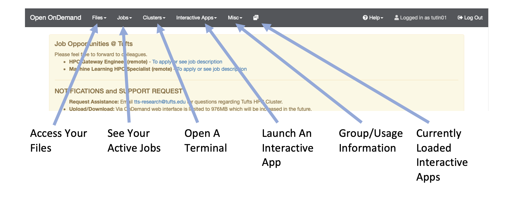

## Introduction To Machine Learning

Machine learning, broadly speaking are algorithms and statistical models to analyze and draw inferences from patterns in data. We find the following cheatsheet useful to understand when to use what method:


## Setup 

For the following machine learning tutorials we will be using glioblastoma data from [cBioPortal](https://www.cbioportal.org/study/summary?id=gbm_cptac_2021).
Before getting started you will need:

- Account on [Tufts HPC](https://access.tufts.edu/research-cluster-account)
- [VPN](https://access.tufts.edu/vpn) if accessing the HPC from off campus

## Navigate To The Cluster

Once you have an account and are connected to the VPN/Tufts Network, navigate to the [OnDemand Website](https://ondemand.pax.tufts.edu/) and log in with your tufts credentials. Once you are logged in you'll notice a few navigation options:



=== "R"

    Click on `Interactive Apps > RStudio Pax` and you will see a form to fill out to request compute resources to use RStudio on the Tufts HPC cluster. We will fill out the form with the following entries:

    - `Number of hours` : `3`
    - `Number of cores` : `1`
    - `Amount of memory` : `32GB`
    - `R version` : `4.0.0`
    - `Reservation for class, training, workshop` : `Default`
    - `Load Supporting Modules`: `curl/7.47.1 gcc/7.3.0 hdf5/1.10.4 boost/1.63.0-python3 libpng/1.6.37 java/1.8.0_60 libxml2/2.9.10 libiconv/1.16 fftw/3.3.2 gsl/2.6`

    Click `Lauch` and wait until your session is ready. Click `Connect To RStudio Server`, and you will notice a new window will pop up with RStudio. Now Create a new project:
    
    1. Go to `File` > `New Project`
    2. `New Directory`
    3. `New Project`
    4. Create a name for your project (e.g. `machine-learning`)
    5. `Create Project`
     
    In terminal, start setting up your directories:
    
    ``` bash
    mkdir data
    mkdir scripts
    mkdir results
    ```
    
    In the `data` folder we will download our data and decompress it:
    
    ``` bash
    cd data
    wget https://cbioportal-datahub.s3.amazonaws.com/gbm_cptac_2021.tar.gz
    tar -xvf gbm_cptac_2021.tar.gz 
    cd ..
    ```

=== "Python"

    ``` py
    # still in development - sorry!
    ```


## References 

- [Oxford Languages](https://www.google.com/url?sa=t&rct=j&q=&esrc=s&source=web&cd=&ved=2ahUKEwjQnZbc2On5AhVuEVkFHY1QBMEQvecEegQIBRAE&url=https%3A%2F%2Flanguages.oup.com%2Fgoogle-dictionary-en&usg=AOvVaw3kNBXVjbAIAFeyFQVCJmJF)

- [SAS Blogs](https://blogs.sas.com/content/subconsciousmusings/2020/12/09/machine-learning-algorithm-use/)
