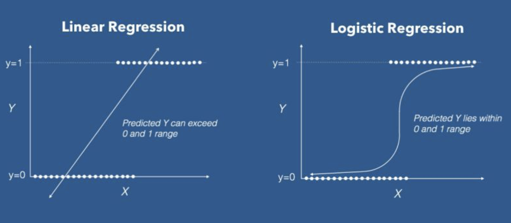
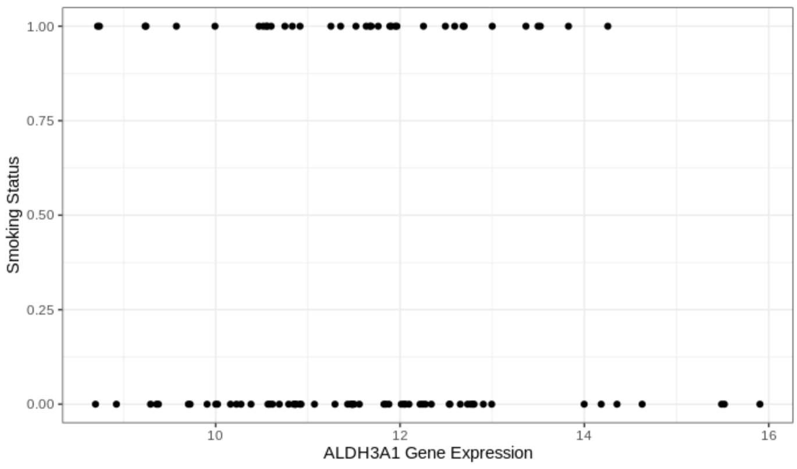

# Introduction To Logistic Regression

!!! example "Prerequisites"
    - [Request an account](http://research.uit.tufts.edu/) on the Tufts HPC Cluster
    - Connect to the [VPN](https://access.tufts.edu/vpn)
    - Please be sure to have followed the instructions on the [setup page](../setup.md)
    
## Logistic Regression

A logistic regression model attempts to classify, so for example can ALDH3A1 gene expression to predict smoking status? So how do we do this? We could fit a linear model to our data but we would end up with something like this:



Here we see that if we used a linear model, we'd end up predicting values that are not our two catetories - smoker or non-smoker (and on the graph 0 or 1). So how do we fit our data when it is binary? We use a sigmoid function:

$$ p(X) = \frac{ e^{\beta_{0} + \beta_{1}X} }{1 + e^{\beta_{0} + \beta_{1}X} } $$

- $p(X)$ : probability of smoking status given ALDH3A1 gene expression
- $X$ : ALDH3A1 gene expression
- $\beta_{0}$ : y intercept
- $\beta_{1}$ : slope of our line

This sigmoid function creates our S-shaped curve! However we'd like our probability to be linear relationship with X. So we can manipulate this equation to get:

$$ \frac{p(X)}{1 - p(X)} = e^{\beta_{0} + \beta_{1}X}$$

Where $\frac{p(X)}{1 - p(X)}$ is known as the **odds ratio** and this can range from $0$ to $\infty$. However, again this doesn't match our 0 to 1 scale, so we take the log of both sides to get:

$$ log(\frac{p(X)}{1 - p(X)}) = \beta_{0} + \beta_{1}X $$

Here we get $log(\frac{p(X)}{1 - p(X)})$ or the **logit function** - where a one unity increase in $X$ increases $p(X)$ by $\beta_{0}$. 

## Pre-processing

First let's do some preprocessing to get our combine ALDH3A1 gene expression with smoking status:

=== "R"

    ```R
    ## load our libraries via our library path
    .libPaths(c("/cluster/tufts/hpc/tools/R/4.0.0"))
    library(tidyverse)
    library(caret)
    library(ggplot2)

    ## load our counts and meta data
    counts <- read.csv(
      file="data/gbm_cptac_2021/data_mrna_seq_fpkm.txt",
      header = T,
      sep = "\t") 

    meta <- read.csv(
      file = "data/gbm_cptac_2021/data_clinical_patient.txt",
      skip=4,
      header = T,
      sep = "\t"
    )

    ## ensure our patient ID's match between 
    ## the counts and meta data
    meta$PATIENT_ID = gsub("-",".",meta$PATIENT_ID)

    ## grab IDH1 gene expression and 
    ## patient ID 
    aldh3a1 = counts %>%
      filter(Hugo_Symbol == "ALDH3A1") %>%
      select(-Hugo_Symbol) %>%
      t() %>%
      as.data.frame() %>%
      mutate(PATIENT_ID = rownames(.))

    colnames(aldh3a1) <- c("aldh3a1","PATIENT_ID")

    ## merge counts and meta data
    merged <- merge(
      meta,
      aldh3a1,
      by="PATIENT_ID")

    ## create smoking status variable
    ## and normalize ALDH3A1 expression
    merged <- merged %>%
      mutate(smoking = ifelse(grepl("non-smoker",SMOKING_HISTORY),0,1)) %>%
      mutate(aldh3a1 = log2(aldh3a1+1))
    ```
=== "Python"

    ```py
    
    ```

## Visualizing Data

Now let's take a look at our data:

=== "R"

    ```R
    ## let's plot our data
    ggplot(merged, aes(x=aldh3a1, y=smoking)) + 
      geom_point() +
      theme_bw() +
      ylab("Smoking Status") +
      xlab("ALDH3A1 Gene Expression") 
    ```
    
    
    
=== "Python"

    ```py
    
    ```

## Create the Model

We see that there isn't a great delineation between the two conditions - smoking and non-smoking. But let's creat our logistic regression model to confirm:

=== "R"

    ```R
    ## let's make our model
    model <- glm( smoking ~ aldh3a1, data = merged, family = binomial)
    summary(model) 
    ```
    
    ```
    Call:
    glm(formula = smoking ~ aldh3a1, family = binomial, data = merged)

    Deviance Residuals: 
        Min       1Q   Median       3Q      Max  
    -1.0299  -0.9776  -0.9364   1.3867   1.4800  

    Coefficients:
                {==Estimate Std. Error z value Pr(>|z|)==}
    (Intercept)  {==0.15978==}    1.61680   0.099    0.921
    aldh3a1     {==-0.05947    0.13897  -0.428    0.669==}
    
    (Dispersion parameter for binomial family taken to be 1)
    
        Null deviance: 127.95  on 96  degrees of freedom
    Residual deviance: 127.77  on 95  degrees of freedom
      (2 observations deleted due to missingness)
    AIC: 131.77

    Number of Fisher Scoring iterations: 4
    ```
    
    Here we note:
    
    - `Estimate` : the model's effect, so here we see that a one unit increase in ALDH3A1 results in a 0.05947 decrease in the probability of being a smoker
    - `Std. Error` : standard error of our estimate
    - `z value` : test stastic - the larger the statistic, the less likely this effect occured by chance
    - `Pr(>|z|)` : pvalue that assesses the effect of ALDH3A1 on Smoking status if the null hypothesis of no effect were correct
    
    You will note that there is not an $r^2$ value for this model like we saw in the [linear regression tutorial](linear-model.md). We will need a special metric known as McFadden's $r^2$:
    
    ```R
    pscl::pR2(model)["McFadden"]
    ```
    
    ```
    fitting null model for pseudo-r2
       McFadden 
    0.001440711 
    ```
    
=== "Python"

    ```py
    
    ```
    
## Visualizing Predictions

We will now plot our logistic regression curve:

=== "R"

    ```R
    ## let's visualize our predictions
    ggplot(merged, aes(x=aldh3a1, y=smoking)) + 
      geom_point() +
      theme_bw() +
      ylab("Smoking Status") +
      xlab("ALDH3A1 Gene Expression") +
      geom_smooth(method = "glm", method.args = list(family = "binomial")) 
    ```
    
    
    
=== "Python"

    ```py
    
    ```

## Recap

So what have we found? Well it seems that ALDH3A1 expression has a minimal effect on the probability of being a smoker. Additionally, our high p-value of 0.669 indicates that we should not reject the possibility that this effect was due to chance. This is also confirmed in our visual of the logistic regression curve - where it is not S shaped. This is due to the absense of some boundry, where some value of ALDH3A1 expression separates smokers and non smokers. We can also see this fit isn't great in McFadden's $r^2$ value of `0.001440711`. McFadden's $r^2$ values close to 0 are indicative of a poor fit while values over 0.4 are indicative of a good fit. 

## Assumptions

When we create a logistic regression model we need to be aware of the limitations:

- the response variable must be binary 
- the observations are independent (i.e. observations can't influence the response of other observations)
- no multicollinearity (will be covered the [multivariate regression tutorial](multivariate-regression.md)) - if you have multiple dependent variables they cannot be correlated
- no outliers
- there must be a linear relationship between the logit function and the dependent variable 

While we will cover multicollinearity in the [multivariate regression tutorial](multivariate-regression.md), we will assess here whether or not there is a linear relationship between the logit function and the dependent variable using the Box-Tidwell test:

=== "R"

    ```R
    ## run the box tidwell test on
    ## our model
    car::boxTidwell(model$linear.predictors ~ merged$aldh3a1[!is.na(merged$aldh3a1)])
    ```
    
    ```
     MLE of lambda Score Statistic (z) {==Pr(>|z|)==}
             1              0.7139     {==0.4753==}

    iterations =  0 
    ```
=== "Python"

    ```py
    ```
Here we note that the probability is above 0.05, implying that ALDH3A1 expression and the logit function are linearly related. 

## References

- [datacamp](https://www.datacamp.com/tutorial/logistic-regression-R)
- [STHDA](http://www.sthda.com/english/articles/36-classification-methods-essentials/151-logistic-regression-essentials-in-r/)
- [Statology](https://www.statology.org/logistic-regression/)
