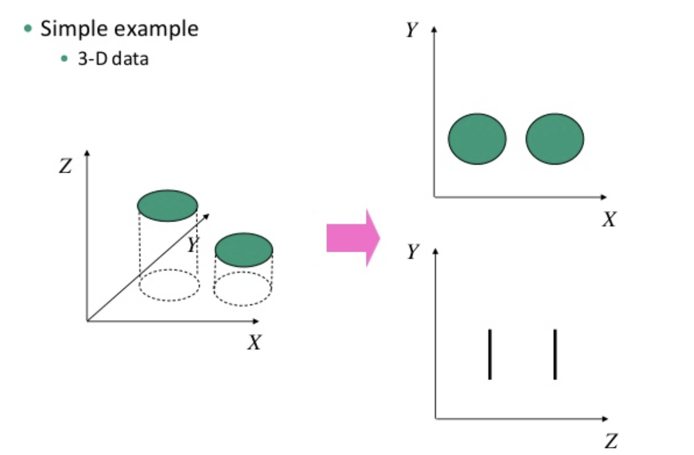

## Dimension Reduction

- Process of reducing the number of variables to a set of principal values where variation in your data becomes apparent. Here is an example with three dimensions:

<figure markdown>
  { width="600" }
  <figcaption>Dimension Reduction Example</figcaption>
</figure>

- Here we see that most of the variation is visible along the x-y axes
- So what are the advantages:

  - simplification
  - denoising
  - variable selection
  - visualization

## Principal Component Analysis (PCA)

- PCA works by summarizing a set of continuous (quantitative) multivariate (multiple variable) data into a set of **linearly uncorrelated** variables called principal components.

### Pros

- can be used on large data
- can be used with sparse data
- preserves the structure (reproducible)

### Cons

- if one variable is on a different scale (like kg instead of g) it can bias the results. So ensure data is on one scale!
- points can be crowded with large numbers of observations and reveal no pattern
- susceptible to outliers

Let's try this in code!

    == R
    
        ```R
        ## load data
        
        ```
        
