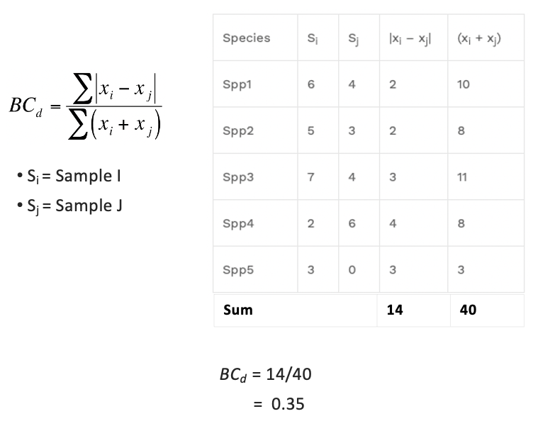
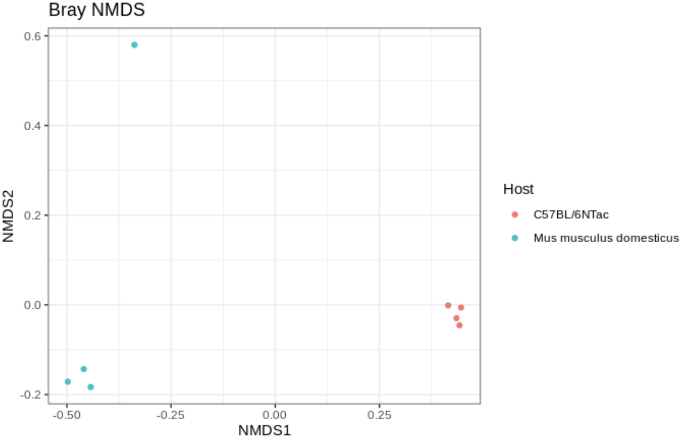

Once we have quantified our community, we can analyze its composition. Two main methods of doing so are exploring the **alpha** and **beta** diversity of the community. First we will need to take our taxonomic data and pass it to the `phyloseq` package for easier manipulation:

```R
# Create phyloseq object

## upload meta data for study
## use this metadata to create the phyloseq object
meta <- read.csv("/cluster/tufts/bio/tools/tool_examples/microbiome16S/metaData.txt")
rownames(meta) <- meta$Run
ps <- phyloseq(otu_table(seqtab.nochim, taxa_are_rows=FALSE), 
               sample_data(meta), 
               tax_table(taxa)
               )
               
# Update ASV names to be shorter

## The full ASV DNA sequence can be hard to look at
## for this reason we move the sequence information to 
## the refseq slot of the phyloseq object
dna <- Biostrings::DNAStringSet(taxa_names(ps))
names(dna) <- taxa_names(ps)
ps <- merge_phyloseq(ps, dna)
taxa_names(ps) <- paste0("ASV", seq(ntaxa(ps)))
```

## Alpha Diversity

- The ecological complexity of a single sample
- We can use the Shannon or Simpson Diversity indices to measure this complexity per sample:


- Here we note:

    - **Shannon Diversity Index:** higher values = higher diversity
    - **Simpson Diversity Index:** higher values = higher diversity

In R we can visualize this with:

```R
# Plotting
plot_richness(ps, x="Host", measures=c("Shannon", "Simpson"), color="Host")+
  theme_bw()+
  theme(axis.text.x = element_text(angle=65,hjust=1))
```


## Beta Diversity

- The ecological complexity between samples
- We can visualize how our samples group together by ordination – a dimension reduction technique to help visualize sample to sample distance. An ordination metric we can use is the Bray-Curtis distance:



We can plot this in R code:

```R
## Transform data to proportions 
## as appropriate for Bray-Curtis distances
ps.prop <- transform_sample_counts(ps, function(otu) otu/sum(otu))
ord.nmds.bray <- ordinate(ps.prop, method="NMDS", distance="bray")
plot_ordination(ps.prop, ord.nmds.bray, color="Host", title="Bray NMDS")+
  theme_bw()
```



Here we note that the wild type and C57BL/6NTac cluster together.

