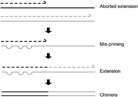

## Merging Reads

- For paired-end data there is a good deal of overlap between the forward and reverse read
- To resolve this redundancy, these reads are collapsed into contigs


Let's do this with code now!

```R
# Merge Read Pairs

## so far we have "denoised", so to speak, 
## these sequence variants. We now need to merge the
## forward and reverse strands
mergers <- mergePairs(
  dadaForward,
  filtForward,
  dadaReverse, 
  filtReverse, 
  verbose=TRUE)
```

## ASV Table

Now that our sequences are merged we can create an ASV counts table, basically telling us how which samples contain which ASV's:

```R
# Making a Sequence Table

## now that we have merged sequences we can construct
## an Amplicon Sequence Variant (ASV) table
## 
seqtab <- makeSequenceTable(mergers)
```

## Chimera Removal

- During Sequencing microbial DNA is subjected to PCR to amplify DNA
- During PCR it is possible for two unrelated templates to form a non-biological hybrid sequence
- DADA2 finds these chimeras by aligning each sequence to more abundant sequences and seeing if there are any low abundant sequences that can be created by  mixing the left and and right sides of the more abundant sequences



Now in code:

```R
# Removing Chimeras

## Chimeric sequences occur as errors during PCR 
## when two unrelated templates for a hybrid sequence
## we will need to remove them before going forward

seqtab.nochim <- removeBimeraDenovo(seqtab, method="consensus", verbose=TRUE)
```

We will also take a moment to do some final QC:

```R
# Final QC

## we have performed quite a few steps 
## and it would be nice to get a final qc check 
## before assigning taxonomy
getN <- function(x) sum(getUniques(x))
finalQC <- cbind(
  out, 
  sapply(dadaForward, getN),
  sapply(dadaReverse, getN),
  sapply(mergers, getN),
  rowSums(seqtab.nochim))
colnames(finalQC) <- c("input", "filtered", "denoisedF", "denoisedR", "merged", "nonchim")
rownames(finalQC) <- sampleNames
finalQC
```

```
           input filtered denoisedF denoisedR merged nonchim
SRR5690809  1000      929       788       743    528     528
SRR5690810  1000      937       766       708    293     293
SRR5690811  1000      930       807       735    360     360
SRR5690812  1000      915       768       756    437     437
SRR5690819  1000      943       761       708    337     337
SRR5690820  1000      911       769       683    349     349
SRR5690821  1000      925       811       700    349     349
SRR5690822  1000      940       802       669    300     300
```

## Assigning Taxonomy

- To determine which taxon each  ASV belongs to DADA2 uses a naïve bayes classifier 
- This classifier uses a set of reference sequences with known taxonomy, here we use the SILVA database, as the training set and and outputs taxonomic assignments with bootstrapped confidence

```R
# Assigning Taxonomy

## dada2 uses a naive Bayes classifier when
## assigning taxonomy. This means we need a training
## set of sequences with known taxonomy information.
## here we use the silva database

taxa <- assignTaxonomy(seqtab.nochim, "/cluster/tufts/bio/tools/training/microbiome16S/silva/silva_nr99_v138.1_train_set.fa.gz")
```
