## Background

Sequencing data analysis typically focuses on either assessing DNA or RNA. As a reminder here is the interplay between DNA, RNA, and protein:

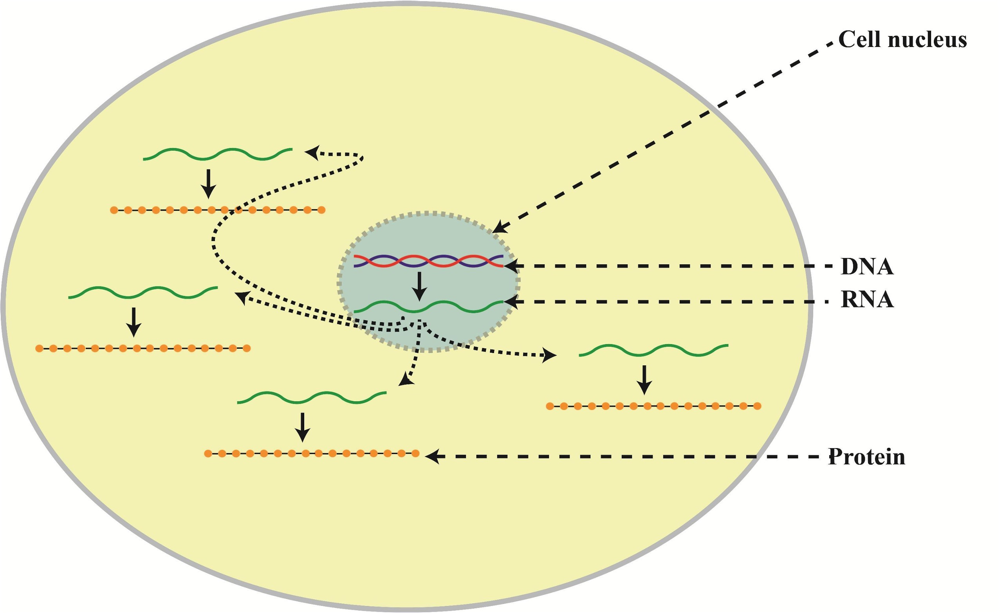

### Types of Sequencing 

**DNA Sequencing**

- Fixed copy of a gene per cell 
- Analysis goal: Variant calling and interpretation

**RNA Sequencing**

- Copy of a transcript per cell depends on gene expression
- Analysis goal: Differential expression and interpretation

!!! note
    Here we are working with DNA sequencing
    
### Next Generation Sequencing

Here we will analyze a DNA sequence using next generation sequencing data. Here are the steps to get that data:

- **Library Preparation:** DNA is fragmented and adapters are added to these fragments


- **Cluster Amplification:** This library is loaded onto a flow cell, where the adapters help hybridize the fragments to the flow cell. Each fragment is then amplified to form a clonal cluster


- **Sequencing:** Fluorescently labelled nucleotides are added to this flow cell and each time a base in the fragment bonds a light signal is emmitted telling the sequencer which base is which in the sequence.

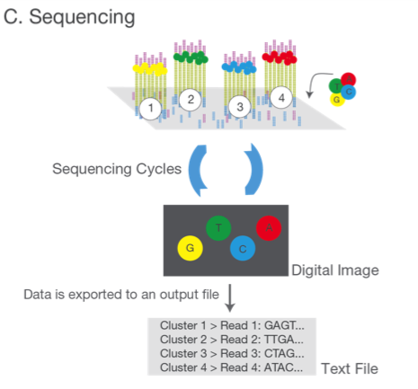

- **Alignment & Data Analysis:** These sequenced fragments, or **reads**, can then be aligned to a reference sequence to determine differences.


### Singe End v. Paired End Data

- **single-end** sequence each DNA fragement from one end only
- **paired-end** sequence each DNA fragement from both sides. Paired-end data is useful when sequencing highly repetitive sequences.
        


### Variant Calling


### Ploidy 

- When discussing variant calling it is worth mentioning an organism's **ploidy**. Ploidy is the number of copies of each chromosomes.

    - Humans cells are diploid for autosomal chromosome and haploid for sex chromosomes
    - Bacteria are haploid
    - Viruses and Yeast can by haploid or diploid


- Variant callers can use ploidy to improve specificity (avoid false positives) because there are expected variant frequencies, e.g. for a diploid:

    - **Homozygous**
    - both copies contain variant
    - fraction of the reads ~1

    - **Heterozygous**
    - one copy of variant
    - fraction of reads with variant  ~0.5

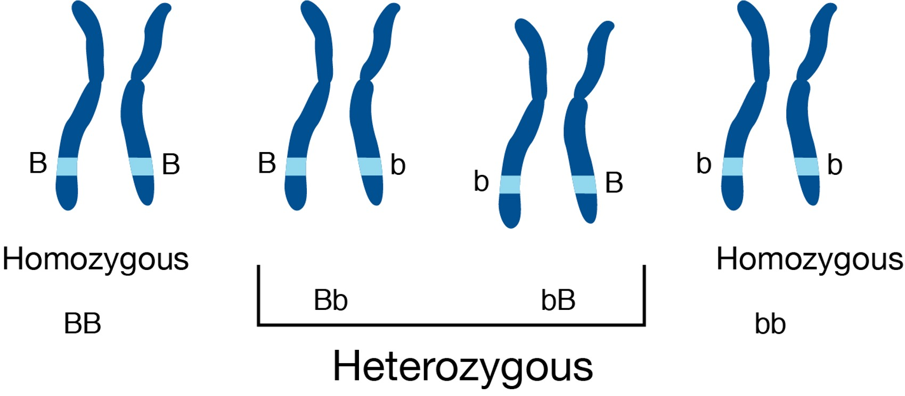

## Setup

!!! abstract "Goals"

    - Connect to the HPC cluster via On Demand Interface
    - Download data

### Log into the HPC cluster's On Demand interface
- Open a Chrome browser and enter the URL [https://ondemand.cluster.tufts.edu](https://ondemand.cluster.tufts.edu)
- Log in with your Tufts Credentials
- On the top menu bar choose `Clusters->Tufts HPC Shell Access`


- Type your password at the prompt (the password will be hidden for security purposes):
`tutln01@login.cluster.tufts.edu's password:`
- You'll see a welcome message and a bash prompt, for example for user `tutln01`:

`[tutln01@login001 ~]$`

This indicates you are logged in to the login node of the cluster.
- Type `clear` to clear the screen

## Set up for the analysis

**Find 500M storage space**

- Check how much available storage you have in your home directory by typing `showquota`.

Result:
```
Home Directory Quota
Disk quotas for user tutln01 (uid 31394):
     Filesystem  blocks   quota   limit   grace   files   quota   limit   grace
hpcstore03:/hpc_home/home
                  1222M   5120M   5120M            2161   4295m   4295m        


Listing quotas for all groups you are a member of
Group: facstaff	Usage: 16819478240KB	Quota: 214748364800KB	Percent Used: 7.00%
```

Under `blocks` you will see the amount of storage you are using, and under quota you see your quota.
Here, the user has used 1222M of the available 5120M and has enough space for our analysis.

- If you do not have 500M available, you may have space in a project directory for your lab.
These are located in `/cluster/tufts` with names like `/cluster/tufts/labname/username/`.
If you don't know whether you have project space, please email [tts-research@tufts.edu](mailto:tts-research@tufts.edu).

### Download the data
- Get an interaction session on a compute node (3 hours, 16 Gb memory, 4 cpu on 1 node) on the default partition (`batch`) by typing:

`srun --pty -t 3:00:00  --mem 16G  -N 1 --cpus 4 bash`

Notes: 
If wait times are very long, you can try a different partitions by adding, e.g. `-p preempt` or `-p interactive` before `bash`.
If you go through this workshop in multiple steps, you will have to rerun this step each time you log in.

- Change to your home directory

`cd `

Or, if you are using a project directory:

`cd /cluster/tufts/labname/username/`

- Copy the course directory and all files in the directory (-R is for recursive):   

`cp -R /cluster/tufts/bio/tools/training/intro-to-ngs/ .`   

(Also available via:  `git clone https://gitlab.tufts.edu/rbator01/intro-to-ngs.git`)

- Take a look at the contents using the `tree` command:

`tree intro-to-ngs`

You'll see a list of all files
```
intro-to-ngs
├── all_commands.sh          <-- Bash script with all commands
├── raw_data                 <-- Folder with paired end fastq files
│   ├── na12878_1.fq         
│   └── na12878_2.fq
├── README.md                <-- Contents description
└── ref_data                 <-- Folder with reference sequence
    └── chr10.fa
2 directories, 5 files
```

### Data for the class

Genome In a Bottle (GIAB) was initiated in 2011 by the National Institute of Standards and Technology "to develop the technical infrastructure (reference standards, reference methods, and reference data) to enable translation of whole human genome sequencing to clinical practice"
([Zook et al 2012](https://www.nist.gov/programs-projects/genome-bottle)).  We'll be using a DNA Whole Exome Sequencing (WES) dataset released by GIAB for the purposes of benchmarking bioinformatics tools.


The source DNA, known as NA12878, was taken from a single person: the daughter in a father-mother-child 'trio'.
She is also mother to 11 children of her own, for whom sequence data is also available. ([HBC Training](https://hbctraining.github.io/In-depth-NGS-Data-Analysis-Course/sessionVI/lessons/01_alignment.html)).
Father-mother-child 'trios' are often sequenced to study genetic links between family members.

As mentioned in the introduction, WES is a method to concentrate the sequenced DNA fragments in coding regions (exons) of the genome.


For this class, we've created a small dataset of reads that align to a single gene that will allow our commands to finish quickly.

Sample: NA12878

Gene: Cyp2c19 on chromosome 10

Sequencing: Illumina, Paired End, Exome

## Quality Control

!!! abstract "Goals"

    - Understand FASTQ file format
    - Run FastQC to asses data quality

### Assess the quality of the raw data

**FASTQ format**

FASTQ files is the most common way to store biological sequence data.
Depending on the sequencing protocol, a single FASTQ file can represent an entire flow cell, a single lane, a single sample, or a portion of a sample.
We have two FASTQ files in our `raw_data` folder, which are the paired end data of a single sample.

From our course directory `into-to-ngs` change into the `raw data` directory:
```markdown
cd raw_data
```

Use the command `head` to look at the first few lines of our first FASTQ file.

```markdown
head na12878_1.fq
```

Each read in our file is represented are by four lines: An identifier, the nucleotide sequence, an optional second identifier and a quality string.
Below is an example, the  arrows on the right show explanation of each line:

```bash
@SRR098401.109756285/1                   <-- Sequence identifier: @ReadID / 1 or 2 of pair
GACTCACGTAACTTTAAACTCTAACAGAAATATACTA…   <-- Sequence
+                                        <-- + (optionally lists the sequence identifier again)
CAEFGDG?BCGGGEEDGGHGHGDFHEIEGGDDDD…      <-- Quality String
```

### Base Quality Scores
The fourth line of each read is called the *quality string*.
Each symbol in the string is an encoding of the *quality score*, representing the inferred base call accuracy at that 
position in the read. 
The manufacturer of the sequencing instrument has performed calibration of quality score by sequencing many 
well-characterized samples from multiple organisms  and studying the correspondence between properties of the signal 
generated by the cluster being sequenced and the accuracy of the resulting base call.

The following two images explain this encoding.
The first image shows the mapping of the encoded quality score to the quality score:


The second image shows the mapping of the quality score to the inferred base call accuracy:


Looking back at our sample read, we can see that the first base has an encoded quality score of `C`.
Using the first image above, we see that C encodes a quality of 34.
Using the second table, we see that the probability is < 1/1000 of that base being an error.
In the next section, we'll see how quality scores and other quality control metrics are used to evaluate the quality of 
a sequenced sample. 

More information on Quality scores from [Illumina](https://www.illumina.com/content/dam/illumina-marketing/documents/products/technotes/technote_understanding_quality_scores.pdf)
 
### FastQC
FastQC is widely used tool for both DNA and RNA sequencing data in order to evaluate the quality of the sequencing data.

To use, load the module: 
```bash
module load fastqc/0.11.8
```

To see the input options, type:
```bash
fastqc --help
```

Result:
```bash
fastqc --help

            FastQC - A high throughput sequence QC analysis tool

SYNOPSIS

	fastqc seqfile1 seqfile2 .. seqfileN

    fastqc [-o output dir] [--(no)extract] [-f fastq|bam|sam] 
           [-c contaminant file] seqfile1 .. seqfileN
...
```

FastQC is run on each FASTQ file separately in order to be sensitive to the variation in quality over lanes, samples, 
and paired-end files.

Since FastQC can run on multiple files at once, we'll use a wildcard `*` to indicate each file in the folder `raw_data`, 
and we specify that the output should be placed in the directory we created called `fastqc`:

```bash
cd ..
mkdir fastqc
fastqc raw_data/* -o fastqc
```

Result:
```markdown
Started analysis of na12878_1.fq
Approx 20% complete for na12878_1.fq
Approx 40% complete for na12878_1.fq
Approx 65% complete for na12878_1.fq
Approx 85% complete for na12878_1.fq
Analysis complete for na12878_1.fq
Started analysis of na12878_2.fq
Approx 20% complete for na12878_2.fq
Approx 40% complete for na12878_2.fq
Approx 65% complete for na12878_2.fq
Approx 85% complete for na12878_2.fq
Analysis complete for na12878_2.fq
```

To view the resulting files:
```
ls fastqc
```

The result shows an `html` file showing graphical results and a `zip` file containing the raw data for each input FASTQ file.
The easist way to view the result is to open the `html` files in a web browser.
```
na12878_1_fastqc.html  na12878_1_fastqc.zip  na12878_2_fastqc.html  na12878_2_fastqc.zip
```
### View results in the On Demand browser

To view the graphical results, return to the tab [ondemand.cluster.tufts.edu](ondemand.cluster.tufts.edu)

On the top menu bar choose `Files->Home Directory`


Navigate to the `fastqc` folder in course directory, e.g.: `/home/username/intro-to-ngs/fastqc/`
Right click on the file `na12878_1_fastqc.html` and select `Open in new tab`.


The new tab that opens in the browser has the results of FastQC for the first reads in the sample.
We'll go through each plot.
Note that the plots shown are representative results for WES data of varying quality, rather than those generated 
on the course data.

### Per base sequence quality

The first plot shows the quality scores vs. position in the read, for all reads in the file.

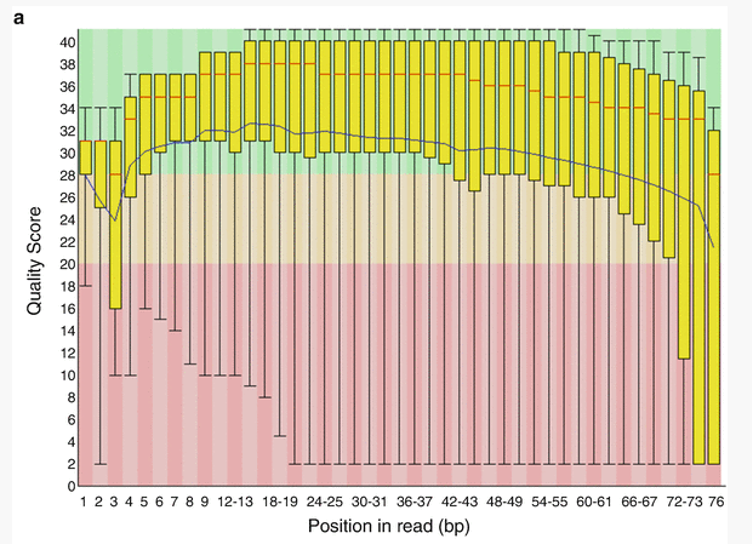

For each position a Box and Whisker type plot is drawn. The elements of the plot are as
follows:
- The central red line is the median value
- The yellow box represents the inter-quartile range (25-75%)
- The upper and lower whiskers represent the 10% and 90% points
- The blue line represents the mean quality

The background of the graph divides the y axis into very good quality calls
(green), calls of reasonable quality (orange), and calls of poor quality (red). 
It is typical for reads generated by Illumina platforms to show reduced quality at the ends of reads due to fragments in
 a cluster becoming out-of-sync ([Fuller et al 2009](http://arep.med.harvard.edu/pdf/Fuller_09.pdf)).


### Per sequence quality scores
The Per Sequence Quality Score plots the distribution of mean sequence quality.
This plot allows will show a peak toward lower mean quality if there is a subset of sequences with  low quality values. 


### Per base sequence content
The Per Base Sequence Content plot shows the the proportion of each base called at each position in the read, 
for all reads in the file.


In a random library you would expect that bases would be present in equal proportions.
In any given genome, however, the relative amount of each base will reflect the overall amount of these bases
in your genome. In any case, we would expect the lines to run parallel to each other.
If you see strong biases which change in different bases then this usually indicates an
overrepresented sequence which is contaminating your library. Below is an example of a library that was contaminated 
with adapter dimers (from sequencing.qcfail.com)[https://sequencing.qcfail.com/articles/contamination-with-adapter-dimers/].


### Per sequence GC content

This plot displays the fraction of G and C bases across for all sequences in the file.
and compares it to a modelled normal distribution of GC content.


In a normal random library you would expect to see a roughly normal distribution of GC
content where the central peak corresponds to the overall GC content of the underlying
genome. The expected GC content is calculated from the observed data and used to build a reference distribution.
An unusually shaped distribution could indicate a contaminated library or some other kinds
of biased subset. A normal distribution which is shifted indicates some systematic bias
which is independent of base position.

### Per base N content

If a sequencer is unable to make a base call with sufficient confidence then it will normally
substitute an N rather than a conventional base. 
This plot shows the percentage of base calls at each position for which an N was substituted.

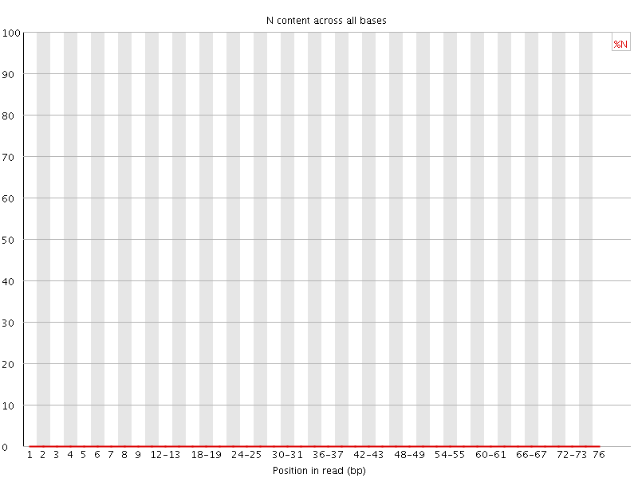

### Sequence Length Distribution

This plot shows the distribution of read sizes in the file.
Depending on the sequencing method and whether reads have been post-processed, it may be expected to have reads of a 
uniform length or varying lengths.
For our raw WES dataset we see a sharp peak at 76 bases, as expected.


### Sequence Duplication Levels

This plot shows the distribution of sequence duplicates in the file.
For example, in the below plot, over 80% of the total sequences are present only once and 10% are present twice.


In a diverse library most sequences will occur only once in the final set. A high
level of duplication may indicate low library complexity or an enrichment bias (e.g. PCR over
amplification).

### Overrepresented sequences

This plot shows the sequences in the file which make up more than 0.1% of the total.
A normal high-throughput library will contain a diverse set of sequences, with no individual
sequence making up a more than a tiny fraction of the whole. Finding that a single sequence is very
overrepresented in the set either means that it is highly biologically significant, or indicates
that the library is contaminated, or not as diverse as you expected.

For each overrepresented sequence the program will look for matches in a database of
common contaminants and will report the best hit it finds. Hits must be at least 20bp in
length and have no more than 1 mismatch. Finding a hit doesn't necessarily mean that this
is the source of the contamination, but may point you in the right direction. It's also worth
pointing out that many adapter sequences are very similar to each other so you may get a
hit reported which isn't technically correct, but which has very similar sequence to the
actual match.

If overrepresented sequences are found but not identified by FastQC, try a 
[BLAST search](https://blast.ncbi.nlm.nih.gov/Blast.cgi).

### Adapter Content

This module looks for common adapters in the sequence.

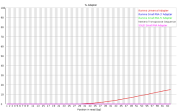

Explanations adapted from [https://dnacore.missouri.edu/PDF/FastQC_Manual.pdf][https://dnacore.missouri.edu/PDF/FastQC_Manual.pdf]

### Optional: Read trimming

In our `Per base sequence quality` we saw that the read quality dropped towards the end of the read.
In order to ensure alignment and variant calling are as accurate as possible, we can perform quality trimming of reads.

[Trim Galore](https://github.com/FelixKrueger/TrimGalore/blob/master/Docs/Trim_Galore_User_Guide.md) is a popular tool 
that in the default mode performs two types of trimming:
Quality trimming: Trims low quality bases from the 3' end of the read
Adapter trimming: Automatically detects and removes known Illumina adapters that may be present in the data

To perform trimming on the data, we first load the software which is installed as an a conda environment.
For more information on using anaconda on the HPC, see [this tutorial](https://sites.tufts.edu/biotools/files/2019/07/conda_on_hpc.pdf).

```
module load anaconda/3
source activate /cluster/tufts/bio/tools/conda_envs/trim_galore/
```

To run:
```
mkdir trim
trim_galore -o trim raw_data/*
```

Result:
```
...
=== Summary ===

Total reads processed:                   4,652
Reads with adapters:                     1,606 (34.5%)
Reads written (passing filters):         4,652 (100.0%)

Total basepairs processed:       353,552 bp
Quality-trimmed:                  24,906 bp (7.0%)
Total written (filtered):        326,448 bp (92.3%)
...
```

Note that Trim Galore may trim adapters [even in the case where FastQC found no adapters](https://github.com/FelixKrueger/TrimGalore/issues/15).
This is because Trim Galore will remove partial adapters at the ends of reads.

The result after trimming is much improved:


## Read Alignment

!!! abstract "Goals"

    - Align short reads to a references genome with BWA
    - View alignment using IGV


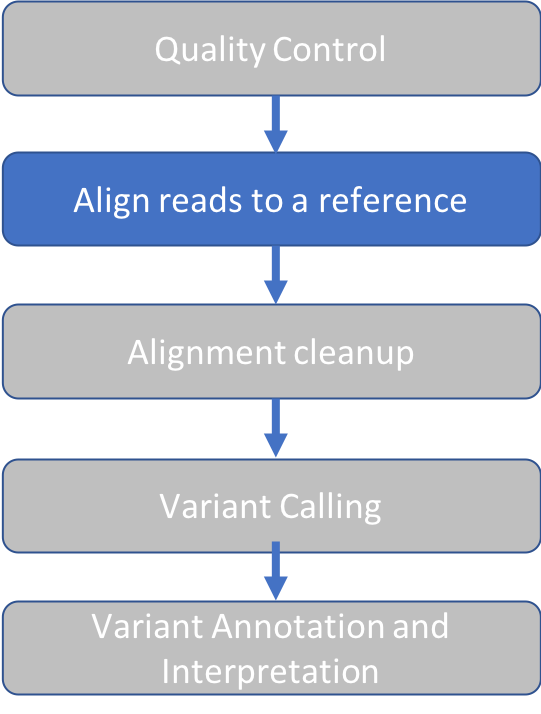


### BWA Overview

Burrows-Wheeler Aligner ([BWA](http://bio-bwa.sourceforge.net/)) is a software package for mapping low-divergent 
sequences against a large reference genome, such as the human genome. 
The naive approach to read alignment is to compare a read to every position in the reference genome until a good match 
is found is far too slow. 
BWA solves this problem by creating an "index" of our reference sequence for faster lookup.

The following figure shows a short read with a red segment followed by a blue segment that 
we seek to align to a genome containing many blue and red segments.
The table keeps track of all the locations where a given pattern of red and blue segments (seed sequence) occurs in the 
reference genome. When BWA encounters a new read, it looks up the seed sequence at the beginning of the read in the table 
and retrieves a set of positions that are potential alignment positions for that read. 
This speeds up the search by reducing the number of positions to check for a good match.

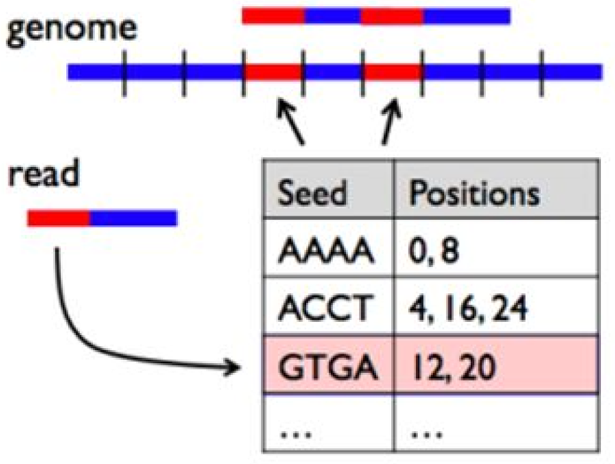

BWA has three algorithms:

- BWA-backtrack: designed for Illumina sequence reads up to 100bp (3-step)
- BWA-SW:  designed for longer sequences ranging from 70bp to 1Mbp, long-read support and split alignment
- BWA-MEM: optimized for 70-100bp Illumina reads

We'll use BWA-MEM. 
Underlying the BWA index is the [Burrows-Wheeler Transform](http://web.stanford.edu/class/cs262/presentations/lecture4.pdf)
This is beyond the scope of this course but is an widely used data compression algorithm.

### BWA Index

In the following steps we'll create the BWA index. 

1. Change to our reference data directory
`cd intro-to-ngs/ref_data`

2. Preview our genome using the command `head` by typing:

`head chr10.fa` 

You'll see the first 10 lines of the file `chr10.fa`:
```buildoutcfg
>chr10 AC:CM000672.2 gi:568336…   <-- '>' charachter followed by sequence name
NNNNNNNNNNNNNNNNNNNNN             <-- sequence
…
```
This is an example of FASTA format. FASTA format is similar to the first two lines of FASTQ format, storing only the 
sequence name and sequence.

3. Load the BWA module, which will give us access to the `bwa` program:
```
module load bwa/0.7.17
```

Test it out without any arguments in order to view the help message.
```markdown
bwa
```

Result:
```markdown
Program: bwa (alignment via Burrows-Wheeler transformation)
Version: 0.7.17-r1198-dirty
Contact: Heng Li <lh3@sanger.ac.uk>

Usage:   bwa <command> [options]

Command: index         index sequences in the FASTA format
…
```

Use the `bwa index` command to see usage instructions for genome indexing

```markdown
bwa index
```

Result
```markdown
Usage:   bwa index [options] <in.fasta>
Options: -a STR    BWT construction algorithm …
```

Run the command as instructed, using the default options:
```markdown
bwa index chr10.fa
```

Result:
```markdown
[bwa_index] Pack FASTA... 0.93 sec
[bwa_index] Construct BWT for the packed sequence...
[BWTIncCreate] textLength=267594844, availableWord=30828588
	[BWTIncConstructFromPacked] 10 iterations done. 50853228 characters processed.
[BWTIncConstructFromPacked] 20 iterations done. 93947292 characters processed.
[BWTIncConstructFromPacked] 30 iterations done. 132245372 characters processed.
[BWTIncConstructFromPacked] 40 iterations done. 166280796 characters processed.
[BWTIncConstructFromPacked] 50 iterations done. 196527516 characters processed.
[BWTIncConstructFromPacked] 60 iterations done. 223406844 characters processed.
[BWTIncConstructFromPacked] 70 iterations done. 247293244 characters processed.
[BWTIncConstructFromPacked] 80 iterations done. 267594844 characters processed.
[bwt_gen] Finished constructing BWT in 80 iterations.
[bwa_index] 59.13 seconds elapse.
[bwa_index] Update BWT... 0.67 sec
[bwa_index] Pack forward-only FASTA... 0.59 sec
[bwa_index] Construct SA from BWT and Occ... 24.98 sec
[main] Version: 0.7.17-r1198-dirty
[main] CMD: bwa index chr10.fa
[main] Real time: 87.087 sec; CPU: 86.306 sec
```

When it's done, take a look at the files produced by typing `ls`.
The following is the result, with arrows and text on the right giving an explanation of each file.

```markdown
chr10.fa      <-- Original sequence
chr10.fa.amb  <-- Location of ambiguous (non-ATGC) nucleotides
chr10.fa.ann  <-- Sequence names, lengths
chr10.fa.bwt  <-- BWT suffix array
chr10.fa.pac  <-- Binary encoded sequence
chr10.fa.sa   <-- Suffix array index
```

### BWA alignment
Let's check the usage instructions for BWA mem by typing `bwa mem`

```markdown
Usage: bwa mem [options] <idxbase> <in1.fq> [in2.fq]

Algorithm options:

       -t INT        number of threads [1]
       -k INT        minimum seed length [19]
       -w INT        band width for banded alignment [100]
       -d INT        off-diagonal X-dropoff [100]
       -r FLOAT      look for internal seeds inside a seed longer than {-k} * FLOAT [1.5]
       -y INT        seed occurrence for the 3rd round seeding [20]
       -c INT        skip seeds with more than INT occurrences [500]
       -D FLOAT      drop chains shorter than FLOAT fraction of the longest overlapping chain [0.50]
       -W INT        discard a chain if seeded bases shorter than INT [0]
       -m INT        perform at most INT rounds of mate rescues for each read [50]
       -S            skip mate rescue
       -P            skip pairing; mate rescue performed unless -S also in use
...
```

Since our alignment command will have multiple arguments, it will be convenient to write a script.

Go up one level to our main `intro-to-ngs` directory:
```markdown
cd ..
```

Make a new directory for our results
```markdown
mkdir results
```

Open a text editor with the program `nano` and create a new file called `bwa.sh`.
```markdown
nano bwa.sh
```

Enter the following text.
Note that each line ends in a single backslash `\`, which will be read as a line continuation.
Be careful to put a space *before* the backslash and *not after*.
This serves to make the script more readable.

```markdown
module load bwa/0.7.17

bwa mem \
-t 2 \
-M \
-R "@RG\tID:reads\tSM:na12878\tPL:illumina" \
-o results/na12878.sam \
ref_data/chr10.fa \
raw_data/na12878_1.fq \
raw_data/na12878_2.fq
```

Let's look line by line at the options we've given to BWA:
1. `-t 2` : BWA runs two parallel threads. Alignment is a task that is easy to parallelize 
because alignment of a read is independent of other reads. Recall that in [Setup](01_Setup.md) we asked for a compute 
node allocation with  `--cpus=4`, which can process up to 8 threads. Here we are using only 2 threads. 

2. `-M` : "mark shorter split hits as secondary". This option will change the SAM flag (discussed in next section) that 
is assigned to short reads that have read segments mapped to distant locations.
It optionn is needed for GATK/Picard compatibility, which are tools we use downstream. [see this explanation on biostars](https://www.biostars.org/p/97323/
)

3. `-R "@RG\tID:reads\tSM:na12878\tPL:illumina" `: Add a read group tag (RG), sample name (SM), and platform (PL) to our alignment file header. 
We'll see where this appears in our output. In addition to being required for GATK, it's advisable to always add these 
labels to make the origin of the reads clear.

4. `-o results/na12878.sam` :  Place the output in the results folder and give it a name

5. The following arguments are our reference, read1 and read2 files, in the order required by BWA:
``` 
ref_data/chr10.fa \
raw_data/na12878_1.fq \
raw_data/na12878_2.fq
```

Exit nano by typing `^X` and follow prompts to save and name the file `bwa.sh`.

Now we can run our script.
```markdown
sh bwa.sh
```

Result:
```markdown
[M::bwa_idx_load_from_disk] read 0 ALT contigs
[M::process] read 9304 sequences (707104 bp)...
[M::mem_pestat] # candidate unique pairs for (FF, FR, RF, RR): (0, 2256, 0, 0)
[M::mem_pestat] skip orientation FF as there are not enough pairs
[M::mem_pestat] analyzing insert size distribution for orientation FR...
[M::mem_pestat] (25, 50, 75) percentile: (120, 160, 216)
[M::mem_pestat] low and high boundaries for computing mean and std.dev: (1, 408)
[M::mem_pestat] mean and std.dev: (172.35, 67.15)
[M::mem_pestat] low and high boundaries for proper pairs: (1, 504)
[M::mem_pestat] skip orientation RF as there are not enough pairs
[M::mem_pestat] skip orientation RR as there are not enough pairs
[M::mem_process_seqs] Processed 9304 reads in 1.034 CPU sec, 0.518 real sec
```

List the files in the results directory by typing `ls results`.
Result:
```markdown
na12878.sam
```
---
### Sequence Alignment Map (SAM)

Take a look at the output file:
```markdown
cd results
head na12878.sam
```
The file has two sections

Header:
```markdown
@SQ     SN:chr10        LN:133797422        <-- Reference sequence name (SN) and length (LN)
@RG     ID:reads        SM:na12878          <-- Read group (ID) and sample (SM) information that we provided
@PG ID:bwa PN:bwa VN:0.7.17… CL:bwa mem     <-- Programs and arguments used in processing
```

Alignment:

1 | 2 | 3 | 4 | 5 | 6 | 7 | 8 | 9 | 10 | 11 | 
------|------|-----|----|------|------|-----|----|------|-----|---- 
SRR098401.109756285 |83 | chr10 |94760653 |60 |76M | = | 94760647 | -82 | CTAA… | D?@A... |
SRR098401.109756285 | 163 | chr10 | 94760647 | 60 | 76M | = 94760653  | 82 | ATTA…   |  ?>@@... | 

The fields:
1. Read ID
2. Flag: indicates alignment information e.g. paired, aligned, etc.
Here is a useful site to [decode flags](https://broadinstitute.github.io/picard/explain-flags.html).
3. Reference sequence name
4. Position on the reference sequence where mapping starts
5. Mapping Quality
6. CIGAR string: summary of alignment, e.g. match (M), insertion (I), deletion (D)
7. RNEXT: Name of reference sequence where the other read in the pair aligns
8. PNEXT: Position in the reference sequence where the other read in the pair aligns
9. TLEN: Template length, size of the original DNA or RNA fragment
10. Read Sequence
11. Read Quality

More information on [SAM format](https://samtools.github.io/hts-specs/SAMv1.pdf).

---
### Alignment Quality Control

Next, we'd like to know how well our reads aligned to the reference genome?
We'll use a tool called `Samtools` to summarize the SAM Flags.

To load the module:
```markdown
module load samtools/1.9
```

To run the `flagstat` program on our `SAM` file:
```
samtools flagstat na12878.sam
```

Result:
```markdown
9306 + 0 in total (QC-passed reads + QC-failed reads)        <-- We have only QC pass reads
2 + 0 secondary                                              <-- 2 reads have >1 alignment position 
0 + 0 supplementary                                          <-- for reads that align to multiple chromosomes
0 + 0 duplicates                                             
9271 + 0 mapped (99.62% : N/A)                               <-- For exome data, >90% alignment is expected    
9304 + 0 paired in sequencing
4652 + 0 read1
4652 + 0 read2
9226 + 0 properly paired (99.16% : N/A)
9240 + 0 with itself and mate mapped
29 + 0 singletons (0.31% : N/A)
0 + 0 with mate mapped to a different chr
0 + 0 with mate mapped to a different chr (mapQ>=5)
```

Samtools flagstat is a great way to check to make sure that the aligment meets the quality expected.
In this case, >99% properly paired and mapped indicates a high quality alignment.

### Summary


## Alignment Cleanup


!!! abstract "Goals"
    - Sort and Index SAM/BAM files
    - Mark duplicate reads in BAM file

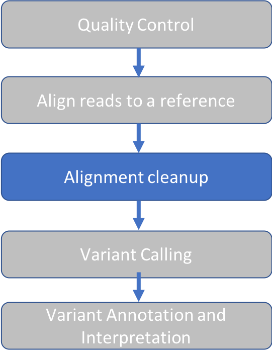

### Sort SAM file

Downstream applications require that reads in SAM files be sorted by reference genome coordinates (fields 3 and 4 in each line of our SAM file).
This will assist in fast search, display and other functions.

1 | 2 | 3 | 4 | 5 | 6 | 7 | 8 | 9 | 10 | 11 |
------|------|-----|----|------|------|-----|----|------|-----|----
SRR098401.109756285 |83 | chr10 |94760653 |60 |76M | = | 94760647 | -82 | CTAA… | D?@A... |

We’ll use the [Picard](https://broadinstitute.github.io/picard/) toolkit for this and othter SAM file manipulations.

Open another script in our course directory called picard.sh
```markdown
cd ..
nano picard.sh
```


Enter the following text:
```markdown
module load picard/2.8.0

picard SortSam \
INPUT=results/na12878.sam \
OUTPUT=results/na12878.srt.bam \
SORT_ORDER=coordinate
```

We have input our SAM file and we will output a Binary Alignment Map (BAM) file, which is a compressed version of SAM format.

Exit nano by typing `^X` and follow prompts to save the file `picard.sh`.

To run the script:
```markdown
sh picard.sh
```

Result:
```markdown
[Fri May 08 15:38:55 EDT 2020] picard.sam.SortSam INPUT=results/na12878.sam OUTPUT=results/na12878.srt.bam SORT_ORDER=coordinate    VERBOSITY=INFO QUIET=false VALIDATION_STRINGENCY=STRICT COMPRESSION_LEVEL=5 MAX_RECORDS_IN_RAM=500000 CREATE_INDEX=false CREATE_MD5_FILE=false GA4GH_CLIENT_SECRETS=client_secrets.json
[Fri May 08 15:38:55 EDT 2020] Executing as rbator01@pcomp31 on Linux 2.6.32-696.1.1.el6.x86_64 amd64; Java HotSpot(TM) 64-Bit Server VM 1.8.0_60-b27; Picard version: 2.8.0-SNAPSHOT
INFO	2020-05-08 15:38:56	SortSam	Finished reading inputs, merging and writing to output now.
[Fri May 08 15:38:57 EDT 2020] picard.sam.SortSam done. Elapsed time: 0.02 minutes.
Runtime.totalMemory()=2058354688
```

Take a look at the results directory:
```markdown
ls results
```

The result shows that the sorted BAM file has been created:
```markdown
na12878.sam  na12878.srt.bam 
```

### Mark Duplicates in BAM file
Many copies are made of a single DNA fragment during the sequencing process.
The amount of duplication may not be the same for all sequences and this can cause biases in variant calling.
Therefore, we mark the duplicates so the variant caller can focus on the unique reads.

Duplicate reads are identified based on their alignment coordinates and CIGAR string.
For example, the below alignment appears to have a G to A mutation in the majority of reads:

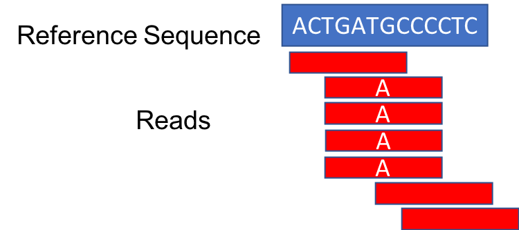

However, when the duplicates are removed, the number of reads supporting the mutation drops to one.

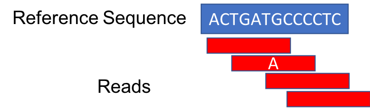


Let's add this step to our `picard.sh` script in order to illustrate how to include multiple steps in a single script.
Note that when we run it, we'll rerun our previous steps as well.

```markdown
nano picard.sh
```
Add the following lines to the end of our script:
```markdown

printf  "..... Starting Mark Duplicates ....\n\n"

picard MarkDuplicates \
INPUT=results/na12878.srt.bam \
OUTPUT=results/na12878.srt.markdup.bam \
READ_NAME_REGEX=null \
METRICS_FILE=results/na12878.markdup.txt
```

The first line is a formatted print (`printf`) statement that will display useful log lines when our script is running.
The option `READ_NAME_REGEX=null` is added because our read names, downloaded from `GIAB` do not contain information about the position on the flowcell.
When present this information can help with estimating [optical duplicated](https://gatk.broadinstitute.org/hc/en-us/articles/360036834611-MarkDuplicates-Picard-).
Typically, datasets do contain this information and it is best to omit this line when processing your data.

To run our script (Note this will rerun the first step as well. This is only for demonstration purposes.
If you were developing this for your own use, you would instead write all commands and run the script once):
```markdown
sh picard.sh
```

In addition to our previous log, we'll see our log line, followed by the output from Mark Duplicates:
```markdown
…
.... Starting Mark Duplicates ....

[Fri May 08 16:03:52 EDT 2020] picard.sam.markduplicates.MarkDuplicates INPUT=[results/na12878.srt.sam] OUTPUT=results/na12878.srt.markdup.sam METRICS_FILE=results/na12878.markdup.txt READ_NAME_REGEX=null    MAX_SEQUENCES_FOR_DISK_READ_ENDS_MAP=50000 MAX_FILE_HANDLES_FOR_READ_ENDS_MAP=8000 SORTING_COLLECTION_SIZE_RATIO=0.25 REMOVE_SEQUENCING_DUPLICATES=false TAGGING_POLICY=DontTag REMOVE_DUPLICATES=false ASSUME_SORTED=false DUPLICATE_SCORING_STRATEGY=SUM_OF_BASE_QUALITIES PROGRAM_RECORD_ID=MarkDuplicates PROGRAM_GROUP_NAME=MarkDuplicates OPTICAL_DUPLICATE_PIXEL_DISTANCE=100 VERBOSITY=INFO QUIET=false VALIDATION_STRINGENCY=STRICT COMPRESSION_LEVEL=5 MAX_RECORDS_IN_RAM=500000 CREATE_INDEX=false CREATE_MD5_FILE=false GA4GH_CLIENT_SECRETS=client_secrets.json
[Fri May 08 16:03:52 EDT 2020] Executing as rbator01@pcomp31 on Linux 2.6.32-696.1.1.el6.x86_64 amd64; Java HotSpot(TM) 64-Bit Server VM 1.8.0_60-b27; Picard version: 2.8.0-SNAPSHOT
INFO	2020-05-08 16:03:52	MarkDuplicates	Start of doWork freeMemory: 2042614304; totalMemory: 2058354688; maxMemory: 28631367680
INFO	2020-05-08 16:03:52	MarkDuplicates	Reading input file and constructing read end information.
INFO	2020-05-08 16:03:52	MarkDuplicates	Will retain up to 110120644 data points before spilling to disk.
INFO	2020-05-08 16:04:03	MarkDuplicates	Read 9300 records. 0 pairs never matched.
INFO	2020-05-08 16:04:09	MarkDuplicates	After buildSortedReadEndLists freeMemory: 2020313280; totalMemory: 2915041280; maxMemory: 28631367680
INFO	2020-05-08 16:04:09	MarkDuplicates	Will retain up to 894730240 duplicate indices before spilling to disk.
INFO	2020-05-08 16:04:11	MarkDuplicates	Traversing read pair information and detecting duplicates.
INFO	2020-05-08 16:04:11	MarkDuplicates	Traversing fragment information and detecting duplicates.
INFO	2020-05-08 16:04:11	MarkDuplicates	Sorting list of duplicate records.
INFO	2020-05-08 16:04:14	MarkDuplicates	After generateDuplicateIndexes freeMemory: 3340626880; totalMemory: 10530324480; maxMemory: 28631367680
INFO	2020-05-08 16:04:14	MarkDuplicates	Marking 864 records as duplicates.
WARNING	2020-05-08 16:04:14	MarkDuplicates	Skipped optical duplicate cluster discovery; library size estimation may be inaccurate!
INFO	2020-05-08 16:04:14	MarkDuplicates	Reads are assumed to be ordered by: coordinate
INFO	2020-05-08 16:04:16	MarkDuplicates	Before output close freeMemory: 10507885056; totalMemory: 10530324480; maxMemory: 28631367680
INFO	2020-05-08 16:04:16	MarkDuplicates	After output close freeMemory: 10507907720; totalMemory: 10530324480; maxMemory: 28631367680
[Fri May 08 16:04:16 EDT 2020] pic
```

### Mark Duplicates Metrics file
The following is the metrics file `na12878.markdup.txt` generated by Picard Mark Duplicates:

| LIBRARY | UNPAIRED_READS_EXAMINED | READ_PAIRS_EXAMINED | SECONDARY_OR_SUPPLEMENTARY_RDS | UNMAPPED_READS | UNPAIRED_READ_DUPLICATES | READ_PAIR_DUPLICATES | READ_PAIR_OPTICAL_DUPLICATES | PERCENT_DUPLICATION | ESTIMATED_LIBRARY_SIZE |

|---|:---:|:---:|:---:|:---:|:---:|:---:|:---:|:---:|:---:|
| Unknown | 29 | 4620 | 2 | 35 | 14 | 425 | 0 | 0.093214 | 23546 |


Normal % duplication for exome sequencing data is 10-30%.
By scrolling to the left in this table we see that our percent duplication is `0.093214%`.

### Index the BAM file

In order to view the alignment with the Integrated Genomics Viewer (IGV) we are required to create an index files for our BAM file.
This facilitates fast lookup of genomics coordinates.

Let's continue editing our script:
```markdown
nano picard.sh
```

Add the following lines at the end of the script:
```markdown
printf  '.... Start BAM Indexing ....\n\n'

picard BuildBamIndex \
INPUT=results/na12878.srt.markdup.bam
```

Run our script:
```markdown
sh picard.sh
```

Result, in addition to previous output:
```markdown
.... Start BAM Indexing ....

[Fri May 08 16:24:17 EDT 2020] picard.sam.BuildBamIndex INPUT=results/na12878.srt.markdup.bam    VERBOSITY=INFO QUIET=false VALIDATION_STRINGENCY=STRICT COMPRESSION_LEVEL=5 MAX_RECORDS_IN_RAM=500000 CREATE_INDEX=false CREATE_MD5_FILE=false GA4GH_CLIENT_SECRETS=client_secrets.json
[Fri May 08 16:24:17 EDT 2020] Executing as rbator01@pcomp31 on Linux 2.6.32-696.1.1.el6.x86_64 amd64; Java HotSpot(TM) 64-Bit Server VM 1.8.0_60-b27; Picard version: 2.8.0-SNAPSHOT
WARNING: BAM index file /cluster/home/rbator01/intro-to-ngs/results/na12878.srt.markdup.bai is older than BAM /cluster/home/rbator01/intro-to-ngs/results/na12878.srt.markdup.bam
INFO	2020-05-08 16:24:18	BuildBamIndex	Successfully wrote bam index file /cluster/home/rbator01/intro-to-ngs/results/na12878.srt.markdup.bai
[Fri May 08 16:24:18 EDT 2020] picard.sam.BuildBamIndex done. Elapsed time: 0.01 minutes.
Runtime.totalMemory()=2058354688
```


We can see the files that were generated by typing `ls results`
```markdown
na12878.sam
na12878.srt.bam
na12878.srt.markdup.bam
na12878.markdup.txt
na12878.srt.markdup.bai     <--- Index file
```

### BAM Visualization with IGV

1. With a Chrome web browser, visit [https://ondemand.cluster.tufts.edu](https://ondemand.cluster.tufts.edu)
2. Login with your Tufts credentials
3. Choose Interactive Apps->IGV. Set parameters, click “Launch”

3. Choose `Interactive Apps->IGV`. Set parameters below and , click `Launch`

4. Choose the following compute resource parameters: 1 hour, 2 cores, 4 GB memory, Default Batch Parition, Default Reservation


5. Click the blue button `Launch NoVNC in New Tab` when it appears

After this the IGV window will appear, probably as a small window on a grey background.
Click the square icon in the top right corner to maximize the window.


### Load reference genome and BAM file

1. Choose reference genome by clicking the `Genomes` menu and selecting `Load Genome from Server...`

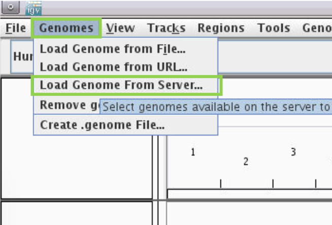


2. Scroll down to `Human hg38`

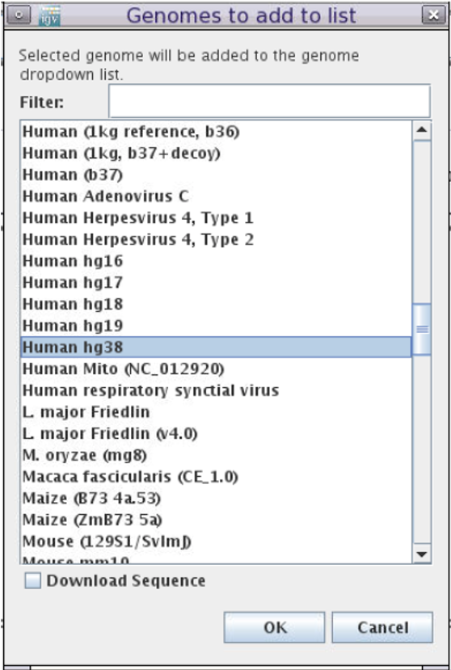

3. DO NOT check `Download Sequnence`

4. Click `OK`

5. Load the BAM file by clicking the `File` menu and select `Load from File...`


6. Navigate to the results folder in the course directory, e.g. `/cluster/home/your-user-name/intro-to-ngs/results`.  

7. Select `na12878.srt.markdup.bam`


You will have the following view:


Each row of data is called a track. There are five tracks visible: the top track shows the pq bands of the entire
chromosome, followed by the reference genome coordinate track, followed by two tracks of our alignment (coverage and reads,
respectively) which don't yet show data, followed by a reference genome annotation track called "Genes".

### Examining a gene

1. In the box indicated in green below, type gene name "Cyp2c19" and hit enter.
You will see the gene model display in the “Genes” track, showing vertical bars where exons are located


Troubleshooting tip: At times IGV on demand will stop allowing the user to type input.
If that happens, close the tab, go back to the on demand window, rejoin the session by clicking `Launch NoVNC in New Tab`.

2. Let's zoom in on exon 7. You can hover over exons in the `Genes` track to get information such as exon number.
Click and drag over a region in the reference coordinate track to zoom in on exon 7 (highlighted in green below.)


3. We can see that there is a variant in this exon.

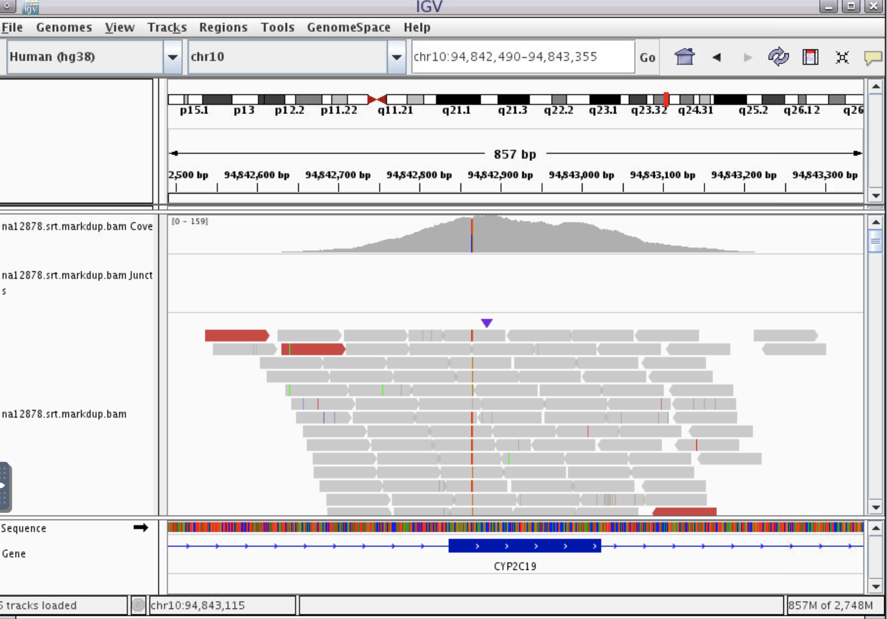

4. Zoom in even further until the nucleotide letters are clear.
Then, hover with your mouse over the coverage track to find out more information about this variant.


It appear there are two variants next to each other: heterozygous`C>T` at position `chr10:94,842,865` and homozygous
`A>G` at position `chr10:94,842,866`. Next, we'll explore the meaning of these variants.


This lesson adapted from [HBC NGS Data Analysis](https://github.com/hbc/NGS_Data_Analysis_Course/blob/master/sessionVI/lessons/01_alignment.md)

## Variant Calling


!!! abstract "Goals"

    - Use Genome Analysis Tool Kit (GATK) to call variants


### Prepare the reference sequence for GATK

GATK requires a Sequence Dictionary for reference genomes used in variant calling.
The sequence dictionary contains names and lengths of all chromosomes in the reference genome.
The information in this file is transferred to the Variant Call File (VCF) when it is produced, so that there is no
ambiguity about which reference was used to produce the file.

Let's open a new script
```markdown
nano prepare.sh
```

Add these lines:
```markdown
module load samtools/1.9
module load picard/2.8.0

samtools faidx ref_data/chr10.fa

picard CreateSequenceDictionary \
REFERENCE=ref_data/chr10.fa \
OUTPUT=ref_data/chr10.dict
```

With these steps, we load the necessary modules, created a FASTA index for our reference sequence, and use Picard to
create our Sequence Dictionary.

Run our script:
```
sh prepare.sh
```

Result:
```
[Fri May 08 16:52:35 EDT 2020] picard.sam.CreateSequenceDictionary REFERENCE=ref_data/chr10.fa OUTPUT=ref_data/chr10.dict    TRUNCATE_NAMES_AT_WHITESPACE=true NUM_SEQUENCES=2147483647 VERBOSITY=INFO QUIET=false VALIDATION_STRINGENCY=STRICT COMPRESSION_LEVEL=5 MAX_RECORDS_IN_RAM=500000 CREATE_INDEX=false CREATE_MD5_FILE=false GA4GH_CLIENT_SECRETS=client_secrets.json
[Fri May 08 16:52:35 EDT 2020] Executing as rbator01@pcomp31 on Linux 2.6.32-696.1.1.el6.x86_64 amd64; Java HotSpot(TM) 64-Bit Server VM 1.8.0_60-b27; Picard version: 2.8.0-SNAPSHOT
[Fri May 08 16:52:35 EDT 2020] picard.sam.CreateSequenceDictionary done. Elapsed time: 0.01 minutes.
Runtime.totalMemory()=2058354688
```

Two new files are created in the folder `ref_data`, our FASTA index (fai) and sequence dictionary (dict):
```markdown
chr10.fa.fai
chr10.dict
```

### Variant Calling with GATK HaplotypeCaller

GATK has two main goals:
- Separate true variants from sequencing error
- Establish which variants co-exist on a single DNA strand (haplotype)

The figure below described the 4 stages of the GATK HaplotypeCaller algorithm (from [software.broadinstitute.org](https://gatkforums.broadinstitute.org/gatk/discussion/11068/haplotypecaller-in-a-nutshell)
).


Paraphrasing from the GATK documentation, the four stages are as follows:

1. Define active regions. The program determines which regions of the genome it needs to operate on,
based on the presence of significant evidence for variation.

2. Determine haplotypes by re-assembly of the active region.
For each active region, the program builds a graph to represent all possible read sequences spanning the region.
For example, the top first read starts in the `TATG` bubble that is common to all reads, then takes the top path to the `A` bubble,
continues through the `AAT`, etc.
The program then realigns each haplotype (path through the graph) against the reference sequence in order to identify
potentially variant sites.

3. Determine likelihoods of the haplotypes given the read data.
The goal of this stage is to evaluate which haplotypes have the most read support.
For each active region, the program performs a pairwise alignment of each read against each haplotype using the PairHMM algorithm,
which takes into account other information about the data, such as quality scores.
This produces a matrix of likelihoods of haplotypes given the read data.
These likelihoods are then used to calculate how much evidence there is for individual alleles at each variant site (marginalization over alleles).

4. Assign sample genotypes.
The final step is to determine which sequences were most likely present in the data.
This step uses Bayes' rule to find the most likely genotype, given the allele likelihoods calculated in the last step.

### Run GATK on our BAM file
To load the module on our system, we'll type:

```markdown
module load GATK/3.7
```
We can check the usage for GATK, which has many tools in addition to HaplotypeCaller:
```markdown
gatk --help
```

The result shows the many different tools inside GATK. The relevant lines for HaplotypeCaller are:
```markdown
…
usage: java -jar GenomeAnalysisTK.jar -T <analysis_type> …
…
 haplotypecaller                 
   HaplotypeCaller               Call germline SNPs and indels via local re-assembly of haplotypes
   HaplotypeResolver             Haplotype-based resolution of variants in separate callsets.
```

For tool specific help, we type:
```markdown
gatk -T HaplotypeCaller --help
```

Let's write a new script:
```markdown
nano gatk.sh
```

Add these lines, which specify the reference file, input BAM, and output VCF.
```markdown
module load GATK/3.7

gatk -T HaplotypeCaller \
-R ref_data/chr10.fa \
-I results/na12878.srt.markdup.bam \
-o results/na12878.vcf
```

Run our script:
```markdown
sh gatk.sh
```

Result:
```markdown
INFO  17:17:41,656 HelpFormatter - -----------
INFO  17:17:41,660 HelpFormatter - The Genome Analysis Toolkit (GATK) v3.7-0-gcfedb67, Compiled 2016/12/12 11:21:18 
…
```

Two new files have appeared in our results folder, the variant call file (VCF) and index file, respectively:
```markdown
na12878.vcf 
na12878.vcf.idx
```

### VCF format

We can take a look at the first few lines of our vcf file:
```markdown
cd results
head na12878.vcf
```

VCF, like BAM files, files contain two sections: A header section, indicated by the presence of `#` at the beginning of the line,
followed by data lines for each variant that was called.
```markdown
##fileformat=VCFv4.2
##FILTER=<ID=LowQual,Description="Low quality">
##FORMAT=<ID=AD,Number=R,Type=Integer,Description="Allelic depths for the ref and alt alleles in the order listed">
##FORMAT=<ID=DP,Number=1,Type=Integer,Description="Approximate read depth …
##FORMAT=<ID=GQ,Number=1,Type=Integer,Description="Genotype Quality">
##FORMAT=<ID=GT,Number=1,Type=String,Description="Genotype">
##FORMAT=<ID=PL,Number=G,Type=Integer,Description="Normalized, Phred-scaled likelihoods for genotypes …
##GATKCommandLine.HaplotypeCaller=<ID=HaplotypeCaller,...
….
##contig=<ID=chr10,length=135534747>
##reference=file:///cluster/home/tutln01/intro-to-ngs/ref_data/chr10.fa
#CHROM	POS	ID	REF	ALT	QUAL	FILTER	INFO	        FORMAT	    NA12878
chr10	96521422	.	A	G	60.28	.         AC=2;AF=1.00; ….  GT:AD:DP:GQ:PL  1/1:0,3:3:9:88,9,0
chr10	96522365	.	T	C	1134.77	.         AC=1;AF=0.500;….  GT:AD:DP:GQ:PL  0/1:47,37:84:99:1163,0,1502
```

The header lines explain the meaning of notation found in the body section of the VCF, as well as information about the
reference and software used to produce the VCF.
The last header line lists the column titles for information, and the last column has the sample name.
VCF can be used to represent multiple samples, and in that case, each sample would have it's own subsequent column.

Let's look at the body section in table format:

| CHROM | POS | ID | REF | ALT | QUAL | FILTER | INFO | FORMAT | NA12878 |
|:---:|:---:|:---:|:---:|:---:|:---:|:---:|:---:|:---:|:---:|
| chr10 | 96521422 | . | A | G | 60.28 | . | AC=2;AF=1.00; …. | GT:AD:DP:GQ:PL | 1/1:0,3:3:9:88,9,0 |

Fixed fields (same for all samples in the VCF)
CHROM - Chromosome
POS - Position
ID - Identifier. May be present if the VCF was annotated with known variants, for example, rs numbers from dbSNP.
REF - Reference sequence base
ALT - Alternate base, comma separated list of non-reference alleles (usually) found in the samples represented by the VCF
QUAL - Phred scaled quality score for the variant, i.e. $10log_{10}$ prob(call is wrong).
FILTER - PASS if this position has passed all filters, otherwise the name of the filter islisted.
INFO - Additional information

Genotype fields (one per sample):
FORMAT - This field specifies the format that will be used to give information in each sample column.
VCF can represent In this case, we see `GT:AD:DP:GQ:PL`, which corresponds to the values `1/1:0,3:3:9:88,9,0`.
GT - Genotype, encoded as allele values separated by either '/' (unphaseD) or '|' (phased - known to be on the same chromosome arm). The allele values are 0 for the reference allele
and 1 for the first allele listed.
AD - Allele depth at this position for the same, reference first followed by first allele listed
DP - Read depth at this position for the sample
GQ - Genotype quality
PL - Genotype liklihoods

For more on the rich VCF format, see [the VCF format specification from Samtools](https://samtools.github.io/hts-specs/VCFv4.2.pdf)

### VCF Quality Control

It's always a good idea when writing a new pipeline, to ask: How well did our variant calling perform?
In this case, the best way to check the performance would be to compare the variants we called in this exercise matched the "known" variants for
NA12878 in the [NIST callset](https://github.com/ga4gh/benchmarking-tools/blob/master/resources/high-confidence-sets/giab.md
). That exercise is beyond the scope of this workshop.

### Add our VCF to IGV

We can add a VCF track to our IGV windows.

1. Go to back to IGV on demand
2. Click the `File` menu and select `Load from File`
3. Select the file `na12878.vcf`

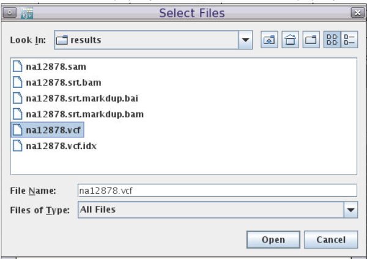

3. We'll see a variant track appear above the coverage track.
Hover over the colored blocks on the variant track in order to see the information in the VCF.


### Summary


## Variant Annotation

!!! abstract "Goals"

    - Use the Variant Effect Predictor (VEP) online web server to annotate variants  
    - Identify amino acid changing substitutions in our VCF


### VEP overview
VEP will add annotation from a number of sources for each variant that we upload.
Below is a subset of the most commonly used annotations annotations.

- Identifiers: Gene, transcript, protein, etc.

- Frequency data: Allele frequency information from multiple public databases.
[1000 Genomes](https://www.internationalgenome.org/data/),
(gnomAD)[https://gnomad.broadinstitute.org/],
(ESP)[https://evs.gs.washington.edu/EVS/]
 Allele frequency information is helpful to understand whether the input variant is common or rare in different geographical populations.

-Pathogenicity predictions:
Computational predictions of whether a variant will affect the protein function.
Various algorithms are available ([SIFT](https://sift.bii.a-star.edu.sg/),
[PolyPhen2](http://genetics.bwh.harvard.edu/pph2/),
[CADD](https://cadd.gs.washington.edu/), etc)

- Disease Association:
Clinical significance and disease association as reported in [ClinVar](https://www.ncbi.nlm.nih.gov/clinvar/).
ClinVar is a widely used database that aggregates and curates clinical reports of variants with clinical determinations.
The clinical significances reported in VEP range from `Benign` to `Pathogenic` and usually have a disease annotation.

- Consequence:
For each variant, VEP identifies all transcripts in the selected database (Ensembl or Refseq) that overlaps with the variant coordinates.
The consequence of the variant with respect to the transcript is then evaluated based on the following diagram.


These consequences are then binned into impact groups: LOW, MODERATE, MODIFIER, HIGH.
For a full mapping to consequence to impact, see [VEP](https://m.ensembl.org/info/genome/variation/prediction/predicted_data.html)

We'll run VEP on the VCF that we produced and analyze the variant consequences.

### Download the VCF
First, we'll download the VCF from the cluster to our local computer.

1. Go back to [https://ondemand.cluster.tufts.edu](https://ondemand.cluster.tufts.edu)
2. In the top grey menu, click `Files` and select `Home Directory`.


3. Select `intro-to-ngs/results/na12878.vcf`


4. Click `Download`

### Run VEP

1. In web browser tab, navigate to to [https://useast.ensembl.org/Tools/VEP](https://useast.ensembl.org/Tools/VEP)
Note that VEP can also be run on the command line on our HPC, resulting in a text file (txt or vcf).
You are welcome to ask for instructions to run the command line VEP.
For single VCF analysis, the web server is recommended in order to take advantage of the visualization tools.

2. In the `Species` section choose `Human (Homo sapiens)` (should be the default)

3. In the `Input data` section choose `Or upload file:` and navigate to the downloaded file `na12878.vcf`

3. Under `Transcript database to use` select `RefSeq transcripts`


4. Click `Run`

### Viewing VEP results
When your job is done, click `View Results`


Our goal is to identify variants that change the coding sequence.
We can see in the `Coding Consequences` box on the right that 20% of the variants are `missense`, which means that they
change the coding sequence of the transcript.

### Filtering VEP consequences
Under `Filters` choose `Consequence` + `is` + `missense_variant` and click `Add`
You should see 1 row - here are a subset of interesting columns:

|Location | Allele | Consequence | IMPACT | SYMBOL | BIOTYPE | Amino_acids |
|:---:|:---:|:---:|:---:|:---:|:---:|:---:|
|10:94842866-94842866 | G | missense_variant | MODERATE | CYP2C19 | protein_coding | I/V |

| Existing_variation | SIFT | PolyPhen | AF | Clinical Significance |
|:---:|:---:|:---:|:---:|
| rs3758581,CM983294 | tolerated(0.38) | benign(0.05) | 0.9515 | |

Based on the annotations, one can conclude that this variant unlikely to cause disease.
This is consistent with what we know about `NA12878` being a healthy individual.

Though the vatiant does change the amino acid from `I` to `V`, both SIFT, PolyPhen both suggest that this change does not
alter protein function.
Furthermore, there is no ClinVar report associated with this variant.
Finally, the maximum allele frequency found for this variant in the `1000 Genomes` database is `0.95`, meaning it is a
very common variant and unlikely to be pathogenic.

### summary


## References

- [Illumina](https://www.illumina.com/content/dam/illumina-marketing/documents/products/illumina_sequencing_introduction.pdf)
- [Ploidy](https://en.wikipedia.org/wiki/Ploidy)
