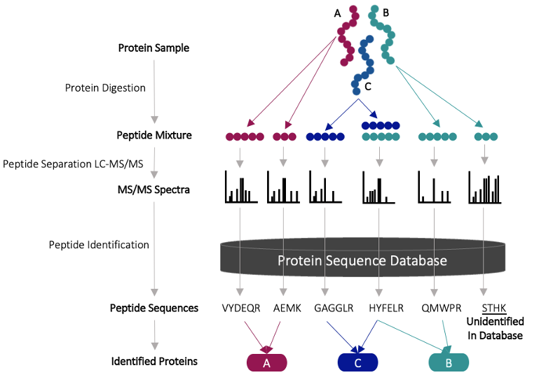
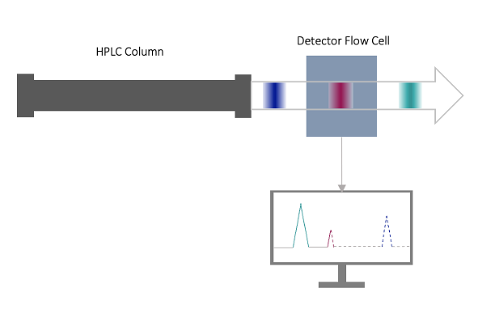
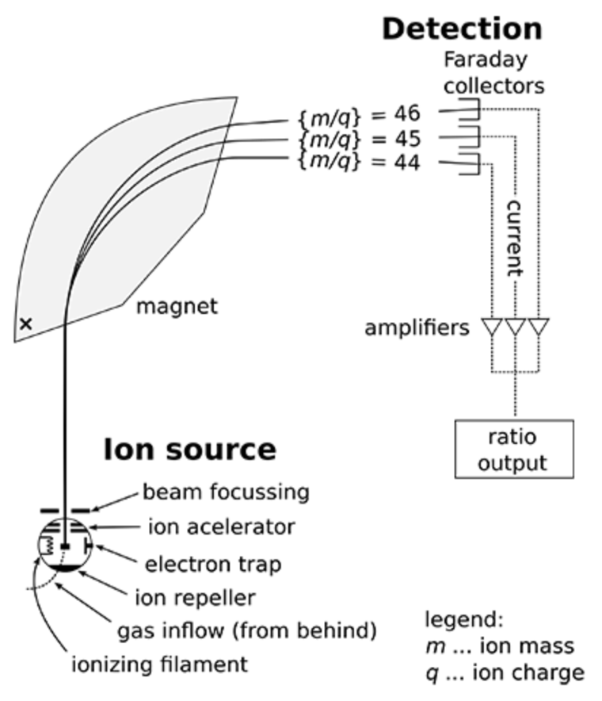
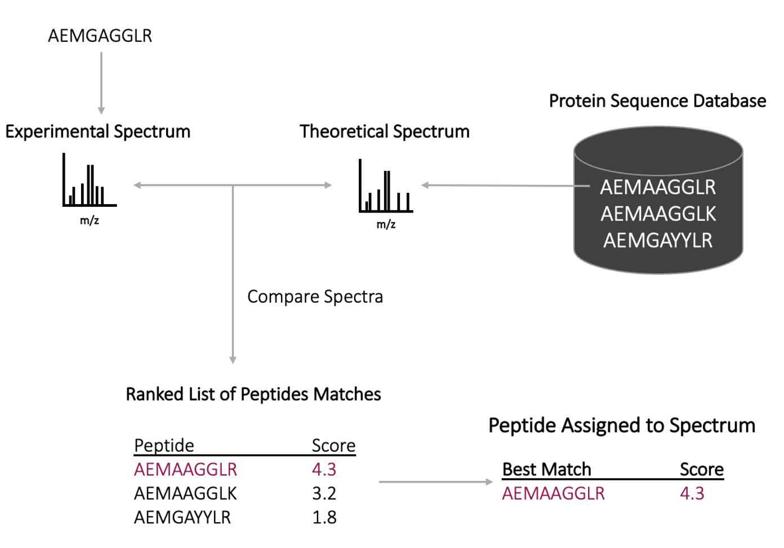
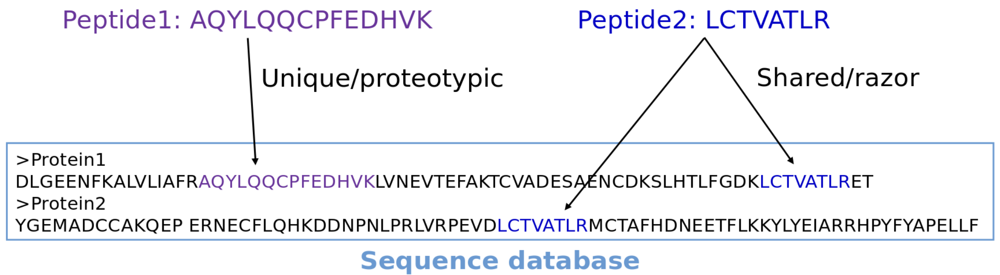

## Background

Proteins are composed of amino acids and the way in which they are arranged determines the final shape of the protein. Proteins have the following levels of organization:

- **Primary Structure:** amino acid sequence
- **Secondary Structure**: amino acid sequences linked by hydrogen bonds
- **Tertiary Structure**: organization of secondary structures
- **Quaternary Structure**: organization of multiple amino acid chains

## Proteomics Data

!!! question ""

    In a tissue sample, whether it be from your skin, liver, heart, etc. - there are millions of protein molecules. So how does one determine which proteins are present in a particular sample?
    
Currently a popular high-throughput stategy to accomplish this is called **shotgun proteomics**, where:

- A protein sample is digested (broken apart) resulting in a peptide mixture
- Those peptides are separated with Liquid Chromatography/Tandem Mass Spectra (LC-MS/MS)
- These spectra are compared to a protein sequence database to identify the peptides

## Protein Digestion

Proteins are often complex 3-dimensional structures, with variable sequences. To assess what proteins are present, we need a way of breaking up these proteins into something we can identify. In shotgun proteomics:

- Proteins are denatured (a process in which protein folding is undone)
- The resulting polymer is digested with a serine protease called Trypsin. 

!!! info 

    Trypsin will cleaves peptide sequences at the c-terminal of **Ariginine (R)** and **Lysine (K)** residues (Unless the next residue is a **Proline (P)**)

## Liquid Chromatography

The next step in this process is to separate these peptides and we can accomplish this with **liquid chromatography**. Currently, **high-pressure liquid chromatography** is often used to achieve separation where-in:

- A solvent (with our peptides) is pumped through, at high pressure, a column with packing material

    - This packing material ensures that peptides (of different sizes, charges, affinity etc.) move at different rates, separating them into bands
    
- As each band passes through a detector at the end of the column, and a peak is created with a height proportional to the concentration of dye in that band.

## Mass Spetrometry

Now that our peptides have been separated, we need to gather more information to be able to identify these peptides. **Mass Spectrometry (MS)** can be used to gain information about the composition of these peptides, where-in:

- Analytes are ionized into gas-phase ions
- The ionized analyates are then separated based on their mass (m) to charge (z) ratio
- The detector marks the number of ions at each m/z value

{ width="300" }

!!! example "Tandem MS/MS"

    Often, this process is repeated in what is called **Tandem MS/MS**. After the first round of MS, the precursor ions are heated with neutral molecules (helium, nitrogen or argon) to achieve a more sensitive detection.

## Protein Identification

Now that we have spectra assoicated with our peptides we need some way of matching these back to a protein. Luckily, there are several databases that can help! The basic principle is as follows:

- Experimental spectrum are correlated to the theoretical spectrum for a protein in a database
- A scoring algorithm is used to assess how well each experimental ion matches the theortical one in the database
- The highest scoring hit is used to then label the peptide

!!! warning "Protein Identification Considerations"

    It should be noted that when identifying peptides, most algorithms will attempt to match non-unique peptides (shared/razor peptides) to a protein that has a unique peptide/ or the most other peptides. In this way the algorithm attempts to safe-gaurd against false positives. In the following example, the second peptide would be assigned to protein 1:
    
    

## References

1. https://rformassspectrometry.github.io/docs/sec-msintro.html
2. http://sepsis-omics.github.io/tutorials/modules/xtandem/#references
3. https://link.springer.com/protocol/10.1385/1-59745-275-0:87
4. https://www.bioconductor.org/packages/release/data/experiment/vignettes/RforProteomics/inst/doc/RforProteomics.html
5. https://medical-dictionary.thefreedictionary.com/Denaturation+(biochemistry)
6. https://febs.onlinelibrary.wiley.com/doi/abs/10.1016/0014-5793%2871%2980373-3
7. https://www.waters.com/nextgen/au/en/education/primers/beginner-s-guide-to-liquid-chromatography/how-does-high-performance-liquid-chromatography-work.html
8. https://www.nature.com/articles/nature01511
9. https://www.sciencedirect.com/science/article/abs/pii/S0076687905020057?via%3Dihub
