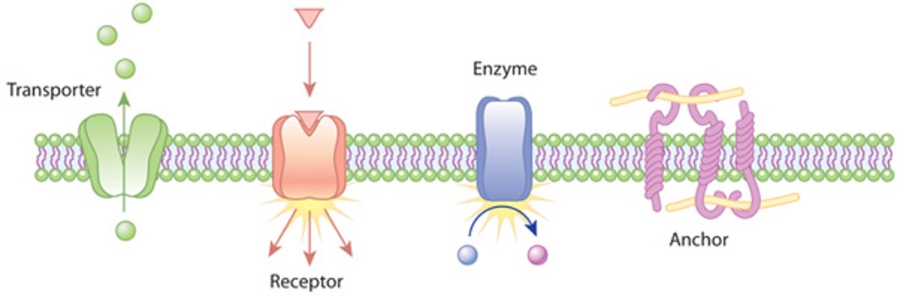

## Background

Proteins are composed of amino acids and the way in which they are arranged determines the final shape of the protein. Proteins have the following levels of organization:

- Primary Structure: amino acid sequence
- Secondary Structure: amino acid sequences linked by hydrogen bonds
- Tertiary Structure: organization of secondary structures
- Quaternary Structure: organization of multiple amino acid chains

