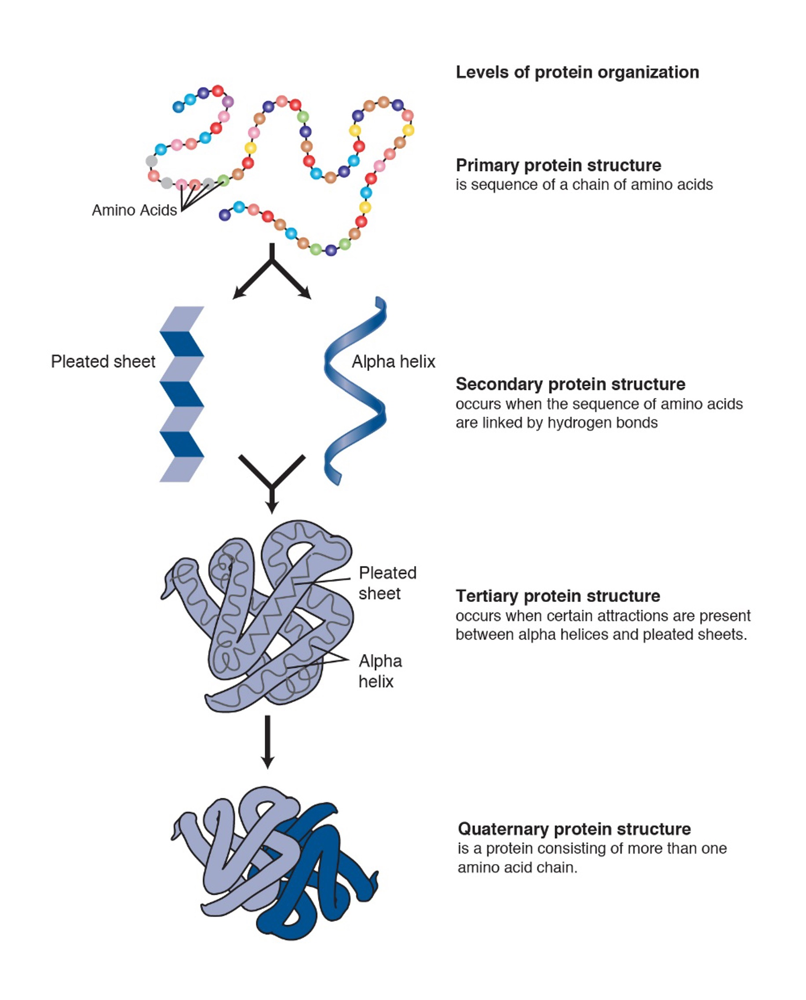

## Background

Proteins are composed of amino acids and the way in which they are arranged determines the final shape of the protein. Proteins have the following levels of organization:

- **Primary Structure:** amino acid sequence
- **Secondary Structure**: amino acid sequences linked by hydrogen bonds
- **Tertiary Structure**: organization of secondary structures
- **Quaternary Structure**: organization of multiple amino acid chains

## Proteomics Data

## References

1. https://rformassspectrometry.github.io/docs/sec-msintro.html
2. http://sepsis-omics.github.io/tutorials/modules/xtandem/#references
3. https://link.springer.com/protocol/10.1385/1-59745-275-0:87
4. https://www.bioconductor.org/packages/release/data/experiment/vignettes/RforProteomics/inst/doc/RforProteomics.html
