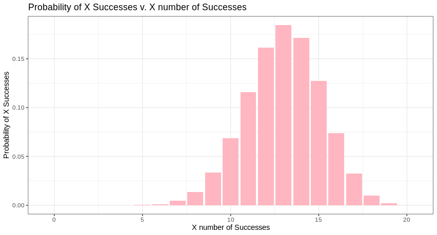

## Estimating Proportions

When we estimate proportions using a sample, this proportion is also subject to sampling error. And just like the mean, we can estimate it's standard error with:

$$SE_p = \sqrt{\frac{\hat{p}(1-\hat{p})}{n}}$$

!!! example "Term Definitions"
    - $SE_p$ standard error of the proportion
    - $\hat{p}$ sample proportion
    - $n$ number of observations
    - $X$ number of successes out of $n$ observations (down below)
    
However, there is an issue with this standard error estimate: When either the $n$ is small or our $\hat{p}$ is extreme (close to 0 or 1) the estimate is not reliable. To remedy this we use the Agresti-Coull interval:

$$p^\prime = \frac{X + 2}{n + 4}$$

So that the confidence interval is:

$$1.96 \pm \sqrt{\frac{p^\prime(1-p^\prime)}{n + 4}}$$

So let's use this formula to estimate the proportion of males in our sample:

```R
library(tidyverse)
library(binom)
# load meta data
meta <- read.table("./data/gbm_cptac_2021/data_clinical_patient.txt",
                   header = T,
                   sep="\t")
#take our sample
sex <- sample(meta$SEX,20)

# define number of successes and number observations
n = length(sex[!(is.na(sex))])
males = length(sex[sex=="Male"])

#calculate our confidence interval
sex.confit <- binom.confint(x = males, n = n, conf.level = 0.95, methods = "ac")

sex.confit
```

```
         method  x  n mean     lower     upper
1 agresti-coull 13 20 0.65 0.4315888 0.8200736
```

## Binomial Distribution

What we have just calculated a confidence interval for a binary variable. Above we measured the interval we believe our true population proportion estimate of males to be between. Now let's switch gears and discuss the probability of $X$ number of males in $n$ independent observations would be:

$$P[X] = \binom{n}{X} p^X (1-p)^{N-X}$$

Where:

$$\binom{n}{X} = \frac{n!}{X!(n-X)!}$$

!!! example "Term Definitions"
    - $n$ number of trials/observations
    - $X$ number of successes
    - $p$ probability of success with each trial/observation
    
We can see that with different numbers of successes come different probabilities. We can plot these differences in probabilities to get an idea of how probability changes when you change the number of successes:

```R
#20 observations/trials
# with a probabilty of 0.65
sex.exact.prob <- data.frame(
  X = 0:20,
  probs = dbinom(x = 0:20, size = 20, prob = 0.65)
)

ggplot(sex.exact.prob, aes(x=X,y=probs)) + 
  geom_bar(fill="lightpink",stat = "identity")+
  theme_bw()+
  labs(
    x="X number of Successes",
    y="Probability of X Successes",
    title="Probability of X Successes v. X number of Successes"
  )
```



!!! note
    You'll note that we use `dbinom` (for the probability density function) - but there is also the option for `pbinom` (for the cumulative density function ). What do these options mean?
    - **probability density function** probability of exactly X successes
    - **cumulative density function** probability of less than or equal to X successes
    
    Here we are trying to determine the probability of exactly X successes which is why we use `dbinom`

## Hypothesis Testing

## References

1. [Wilson score and Agresti-Coull intervals for binomial proportions](https://statisticaloddsandends.wordpress.com/2019/06/09/wilson-score-and-agresti-coull-intervals-for-binomial-proportions/)
2. [BIOL - 202: Analyzing a single categorical variable](https://ubco-biology.github.io/BIOL202/estproportions.html)
