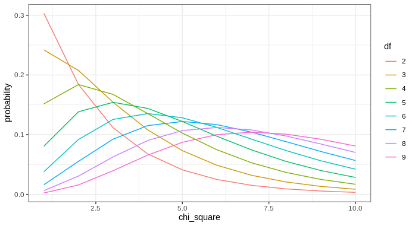

## Chi-Square Test

When comparing categorical variables, your data won't always have 2x2 dimensions as in the [Fisher's Test Topic Note](fisher-test.md). 
For tables with greater dimensions we can use the Chi-square test to test hypotheses of association. 
The Chi-Square or $\chi^2$ test is defined by:

$$\chi^2 = \sum_i{\frac{(O_i-E_i)^2}{E_i}}$$

with:

$$d.f. = (r-1)(c-1)$$

!!! example "Explanation of Terms"
    
    - $\chi^2$ chi-square statistic
    - $O_i$ observed value at cell i
    - $E_i$ expected value at cell i
    - $d.f.$ degrees of freedom
    - $r$ number of rows
    - $c$ number of columns
    
This $\chi^2$ value is then compared to a probability distriubtion. In our [Binomial Test Topic Note](binomial-test.md), we described that 
probability distributions help us determine the probability of an event given some parameter. In the [Binomial Test Topic Note](binomial-test.md),
that parameter was the number of successes, but here it is our degrees of freedom. We won't cover the math of this probability distribution function
here, but if your curious check out [the wikipedia page on chi-sqare distributions](https://en.wikipedia.org/wiki/Chi-squared_distribution). 
Let's use R to examine how probability changes with varying degrees of freedom and $\chi^2$ values:

```R
# examine the chi square cdf
chi.sq.df <- data.frame(
  probability = 0,
  chi_square = 0,
  df = 0
)
for(i in 2:9){
  chi.sq.df.i <- data.frame(
    probability = dchisq(1:10,i),
    chi_square = 1:10,
    df = rep(as.character(i),10)
  )
  chi.sq.df <- rbind(chi.sq.df,
                     chi.sq.df.i)
}
chi.sq.df <- chi.sq.df[-1,]


ggplot(chi.sq.df,            
       aes(x = chi_square,
           y = probability,
           color = df)) +  
  geom_line()+
  theme_bw()
```



