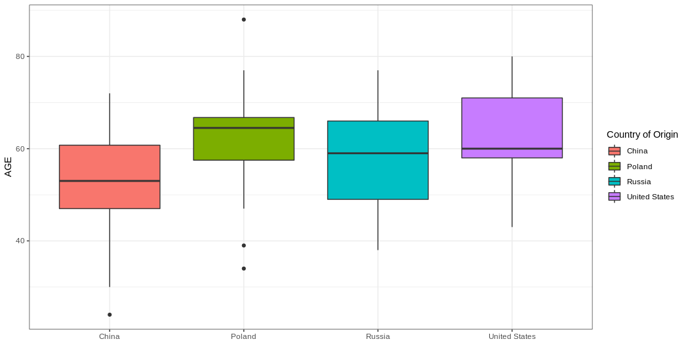

## One-Way ANOVA Hypothesis 

In the [paired t-test topic note](paired-t-test.md), and the [two-sample t-test topic note](two-t-test.md) we discussed how to compare the means between
two groups. What if you'd like to compare the means of two or more groups? This problem can be solved using a one-way ANOVA. The hypothesis of the One-Way
ANOVA states:

- $H_0$ : there is no difference between the means of each group
- $H_a$ : One or more of the group means is different from the other group means

## Between Group Sum of Squares

To determine this difference we first calculate the between group sum of squares:

$$ SS_{between} =  \sum_a^z{n_a(x_a - \overline{X})} $$

!!! example "Explanation of Terms"
    - $SS_between$ : between group sum of squares
    - $a$ : group a
    - $z$ : last group
    - $x_a$ : mean of group a
    - $n_a$ : sample size of group a
    - $\overline{X}$ : mean of all groups
    
So here we see that for each group we will subtract the total mean from the group mean and multiply that value by sample size of that group. We then take 
all those values for each group and add them together to get the sum of squares. 

## Within Group Sum of Squares

Now we will need to calculate the within group sum of squares:

$$ SS_{within} = \sum_a^z{(x_{ia} - \overline{x_a})}$$
    
!!! example "Explanation of Terms"
    - $SS_{within}$ : within group sum of squares
    - $a$ : group a
    - $z$ : last group
    - $x_ia$ : value i in group a
    - $\overline{x_a}$ : mean of group a
    
Here we note that for each group we sum the difference from the mean for each value and add them together. Then when we are done adding these differences 
for each group we add those values together to get the within group sum of squares.

## One-Way ANOVA F-Statistic

Now to get our F-statistic we need to calculate the between group mean square value and the within group mean square value:

$$ MS_{between} = \frac{SS_{between}}{k - 1}$$

$$ MS_{within} = \frac{SS_{within}}{t - k}$$

$$ F = \frac{MS_{between}}{MS_{within}}$$

!!! example "Explanation of Terms"
    - $F$ : F-statistic
    - $MS_{between}$ : between group mean square value
    - $MS_{within}$ : within group mean square value
    - $k$ : number of groups
    - $t$ : total number of observations between all groups
    - $SS_{between}$ : between group sum of squares

## Visualizing our data

As you can see this is pretty laborious. Luckily, R can do these calculations for us and we will use R to determine if there is any significant 
difference in age between the patient's country of origin. Here we will filter out countries that have less than 5 observations. First let's try a 
visual inspection of our data:

```R
# one-way ANOVA
library(tidyverse)
# load meta data
meta <- read.table("./data/gbm_cptac_2021/data_clinical_patient.txt",
                   header = T,
                   sep="\t")

# isolate countries and ages
countries_ages <- meta %>%
  filter(COUNTRY_OF_ORIGIN %in% c("China","Poland","Russia","United States"))

# plot our data
ggplot(countries_ages,aes(x=COUNTRY_OF_ORIGIN,y=AGE,fill=COUNTRY_OF_ORIGIN)) +
  geom_boxplot()+
  theme_bw()+
  labs(
    x="",
    y="AGE",
    fill="Country of Origin"
  )
```



Here we can visually see that the mean age of patients from China is lower than the other groups.

## One-Way ANOVA in R

Let's now apply a One-Way ANOVA in R and output the summary of results:

```R
# calculate our one-way ANOVA
anova_res <- aov(AGE ~ COUNTRY_OF_ORIGIN, data = countries_ages)

# print out a summary of results
summary(anova_res)
```

```
                  Df Sum Sq Mean Sq F value Pr(>F)  
COUNTRY_OF_ORIGIN  3   {==1583   527.6   3.824 0.0128==} * 
Residuals         84  {==11591   138.0==}                 
---
Signif. codes:  0 ‘***’ 0.001 ‘**’ 0.01 ‘*’ 0.05 ‘.’ 0.1 ‘ ’ 1
```

!!! info "Explanation of Results"
    - Here we see that our between sum of squares is `1583` and our within sum of squares is `11591`
    - We also note that our between group mean square value is `527.6` and our within mean square valueis `138.0`
    - By dividing our between group mean square value by the within mean square value we get an F-statistic of `3.824`
    - We notice a p-value of `0.0128`, below 0.05, giving us enough evidence to reject the null:
        - that there is not a difference between group means
        
## Assumptions

Like any statistical test, we make assumptions. The assumptions made by the one-way ANOVA are:

- The residuals 
