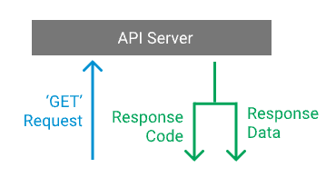
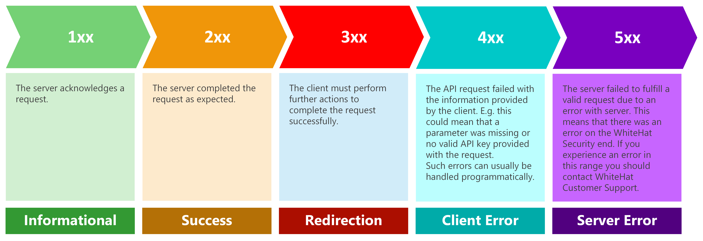

## API Queries

An API, or Application Programming Interface, is a way of accessing data directly from a website. In this way we can pull data from a website without having to deal with parsing HTML content. An API request occurs between a client and a server:

<figure markdown>
  {}
  <figcaption>Image by [DATAQUEST](https://www.dataquest.io/blog/r-api-tutorial/)</figcaption>
</figure>

Essentiall, we (the client) reach out to the server and request data. In return we get the data and a response code telling us how the request went. Sometimes we don't get the data and the response code can give us a hint as to why:

<figure markdown>
  {}
  <figcaption>Image by [WhiteHat](https://apidocs.whitehatsec.com/whs/docs/error-handling)</figcaption>
</figure>

Each website (with an available API) should have more specific documentation on these codes and how to structure your request. Here we are going to cover how to use the STRINGDB API using Python and R. 

## API Request

## API Data Handling

## References

1. https://www.dataquest.io/blog/r-api-tutorial/
2. https://www.dataquest.io/blog/python-api-tutorial/
3. https://apidocs.whitehatsec.com/whs/docs/error-handling
