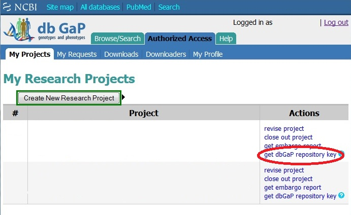

## Downloading Data Using dbGAP

dbGAP is a repository of data assessing the connection between genotypes and phenotypes. Here we discuss how to access this data using the Tufts HPC.

1. Obtain your dbGaP repository key by logging into dgGAP and clicking "get dbGAP repository key"

!!! info "[dbGAP Download Guide](https://www.ncbi.nlm.nih.gov/sra/docs/sra-dbgap-download/)"

    

2. Upload this file to your cluster account. For more information on how to login to the cluster visit: [Navigate To The Cluster](../hpc-user-guide/navigate-to-cluster.md)

3. 
## References

1. [dbGAP Download Guide](https://www.ncbi.nlm.nih.gov/sra/docs/sra-dbgap-download/)
