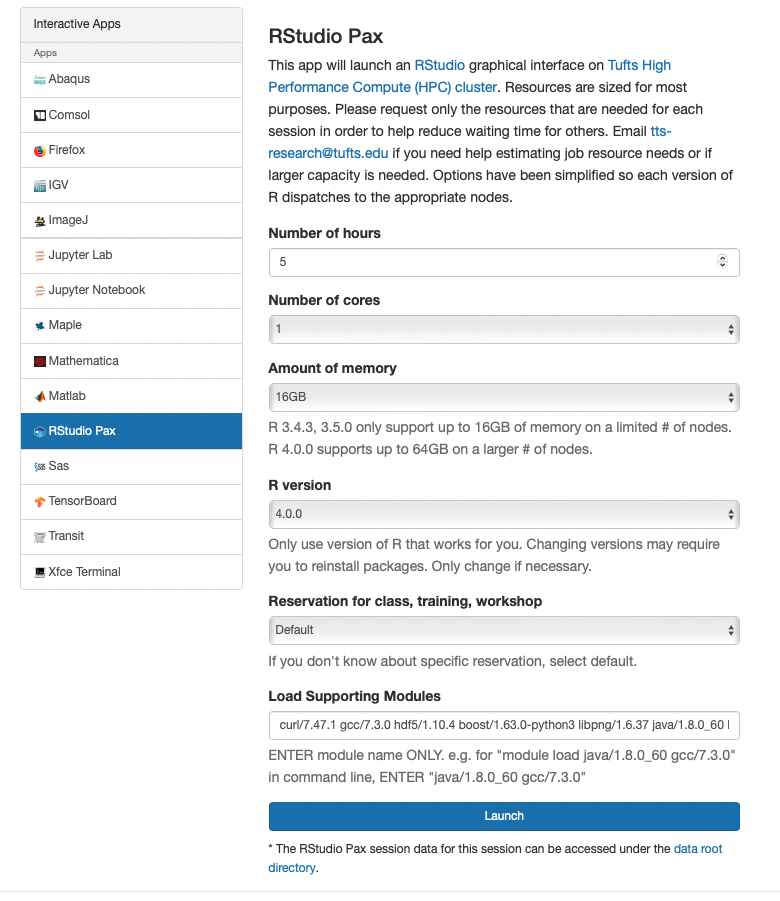

## RStudio Interactive App on OnDemand

- Go to [OnDemand](https://ondemand.cluster.tufts.edu) Login with your username and password
- Go to `Interactive Apps` tab and select `RStudio`
- Select the time, number of cores, CPU memory you need, as well as the version of R you wish to run. 

- Load the module you need for your packages to run, if no additional modules are needed, leave it blank.
- Each user can only start one OnDemand RStudio session on one compute node at a time. If you need to start multiple RStudio sessions, please make sure you select a different nodename from your current running session. 
- Click "Launch" and wait for available resources
- Once it's ready, click on the `Connect to RStudio` button
- When you finished, exit RStudio properly `q()`, then close the RStudio tab, and go back to the main page click `Delete` to end the session
